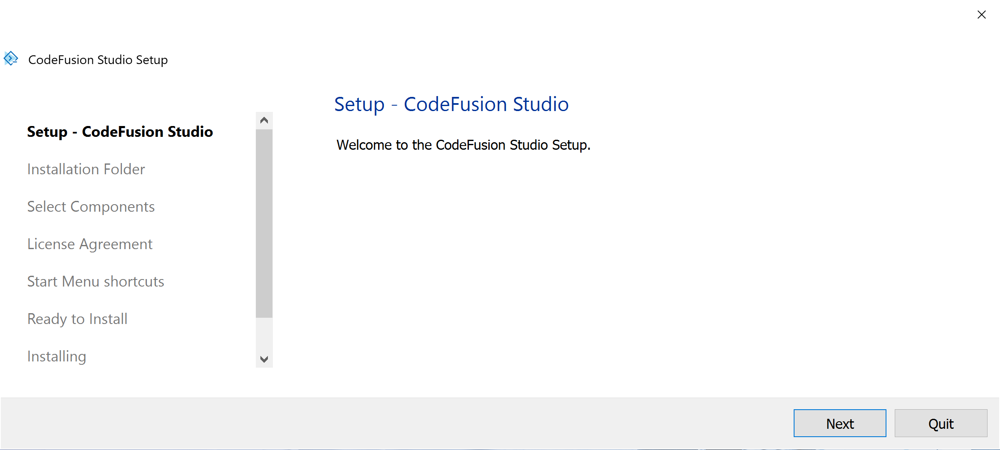
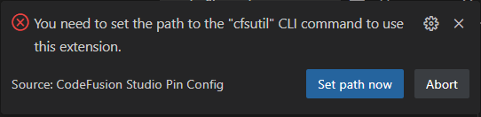

# Overview

Codefusion Studio (CFS) is an embedded software development platform based on Microsoft's Visual Studio Code (VS Code). It provides best in class development tooling for embedded processors and MCUs by providing intuitive tools for newcomers while enabling advanced features for expert embedded developers.

## About CFS

- Homepage with quick access links for common tasks, links to articles and videos related to your projects, user guides, hardware reference manuals, data sheets, and other useful resources.
- A Workspace Creation wizard for quickly creating per-core projects as well as example applications to jumpstart your development.
- Toolchains that support building for Arm Cortex-M, RISC-V, and other architectures available in supported ADI products.
- System Planner with tools for allocating peripherals and memory per core, assigning signals to pins, configuring pin and clock behavior, viewing registers, and generating source code to include in your project.
- Essential debugging tools including heterogeneous multi-core debugging, breakpoints, disassembly, cross-core debugging, and RTOS thread awareness.
- An extensible plugin architecture that separates config choice capture from code generation, giving developers the freedom to choose RTOS, middleware, and firmware platforms.

## Supported Processors

CodeFusion Studio currently supports the following processors in the following configurations:

| Processor                                                      | MSDK | Zephyr | Config Tools   | TESA       |
| -------------------------------------------------------------- | ---- | ------ | -------------- | ----------- |
| [MAX32650](https://www.analog.com/en/products/max32650.html)   | Yes  | Yes    | No             |  Yes[^1]    |
| [MAX32655](https://www.analog.com/en/products/MAX32655.html)   | Yes  | Yes    | Yes            |  Partial[^2]|
| [MAX32660](https://www.analog.com/en/products/max32660.html)   | Yes  | Yes    | No             |  No         |
| [MAX32662](https://www.analog.com/en/products/MAX32662.html)   | Yes  | Yes    | No             |  Partial[^2]|
| [MAX32666](https://www.analog.com/en/products/max32666.html)   | No   | Yes    | No             |  No         |
| [MAX32670](https://www.analog.com/en/products/MAX32670.html)   | Yes  | Yes    | No             |  Yes[^1]    |
| [MAX32672](https://www.analog.com/en/products/MAX32672.html)   | Yes  | Yes    | No             |  Partial[^2]|
| [MAX32675C](https://www.analog.com/en/products/max32675c.html) | Yes  | Yes    | No             |  No         |
| [MAX32690](https://www.analog.com/en/products/MAX32690.html)   | Yes  | Yes    | Yes            |  Yes[^1]    |
| [MAX78000](https://www.analog.com/en/products/MAX78000.html)   | Yes  | Yes    | No             |  Partial[^2]|
| [MAX78002](https://www.analog.com/en/products/MAX78002.html)   | Yes  | Yes    | No             |  No         |

[^1]: Full TESA support, including UCL and USS.
[^2]: UCL support only.

## Install CFS

This section provides instructions for installing and setting up CodeFusion Studio for [supported processors](#supported-processors).

### Software Requirements

#### Dependencies

Tools VS Code extensions depend on:

- [Microsoft's Visual Studio Code](https://code.visualstudio.com/) version 1.89.0 or later.

#### Host OS Support

 CodeFusion Studio and extensions are supported on the following host operating systems:

- Windows 10 or 11 (64-bit)
- macOS (ARM64)
- Ubuntu 22.04 and later (64-bit)

#### Download CFS

Download CodeFusion Studio from the [CodeFusion Studio Developer Resources](https://developer.analog.com/solutions/codefusionstudio) page or use the links below:

- [Windows](https://download.analog.com/codefusion-studio/1.1.0/CodeFusionStudio_1.1.0.exe)
- [Linux](https://download.analog.com/codefusion-studio/1.1.0/CodeFusionStudio_1.1.0.run)
- [macOS](https://download.analog.com/codefusion-studio/1.1.0/CodeFusionStudio_1.1.0.dmg)

#### Install

> **Note:**
> The Linux installer downloads without execute permissions. Run `chmod a+x <installer>` to grant execute permissions before continuing.

1. Double click the SDK (`.exe`, `.dmg`, `.run`) to launch the setup wizard. 
1. Follow the on-screen instructions to begin setup.
1. Specify the installation folder when prompted. We recommend using the default location.
1. Select the default or desired components to install, then proceed to the next step.
1. Review and accept the license agreement to continue.
1. (Windows only): Choose the Start Menu folder for the shortcut.
1. Review your selections and start the installation.
1. When the installation is complete, close the wizard.

### Set up CFS

#### Set CodeFusion Studio SDK path

Change your SDK path if prompted or manually configure it in user settings.

1. Open Settings (press `Ctrl,` on Windows/Linux or `Cmd,` on macOS, or use the gear icon in the lower-left corner).
1. Search for `cfs.sdk.path`.
1. Set the path to your CodeFusion Studio SDK installation directory. For example, `C:\analog\cfs\1.1.0` on Windows.

> **Note:**
> You may need to restart VS Code after setting the path.

#### Set CFSUtil path

> **Note:**
> By default, the CFSUtil path points to `${config:cfs.sdk.path}/Utils/cfsutil/bin/cfsutil`.
> The default CFSUtil path should be sufficient in most cases.

Change your CFSUtil path if prompted or manually configure it in user settings.

### Install the VS Code extension

> **Note:**
> The VS Code extension can be installed from the [VisualStudio Marketplace](https://marketplace.visualstudio.com/items?itemName=AnalogDevices.cfs-ide), or manually from the CodeFusion Studio installation.
> This step is only required if you need to manually install an extension.

#### **Manual Installation**

1. Open Visual Studio Code.
2. Go to the `Extensions` tab.
3. Click **Views and More Actions** `...` and select `Install from VSIX`.
4. Browse to the `<codefusion-sdk-install>/VSCode` directory and select the required `*.vsix` file.

### (Optional) Install Olimex Arm JTAG Drivers

The Olimex ARM-USB-OCD-H debugger is required to debug the RISC-V core on supported MAX parts. The Olimex drivers are not provided directly by CodeFusion Studio and need to be installed manually if RISC-V Debugging is required.

Download and installation instructions can be found in chapter 3 of the [Olimex ARM-USB-OCD-h User Manual](https://www.olimex.com/Products/ARM/JTAG/_resources/ARM-USB-OCD_and_OCD_H_manual.pdf)

## Additional Documentation

For more information, refer to the [User Guide for CodeFusion Studio](https://developer.analog.com/docs/codefusion-studio/latest).
