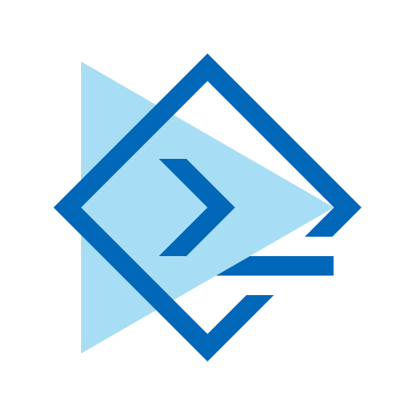

# User documentation

This is the user documentation for CodeFusion Studio&trade;.

!!! note
    You can toggle between light and dark mode using the sun and moon icons on the top right of the page.

- [User guide](user-guide/index.md)
- [Tutorials](tutorials/index.md)
- [Resources](user-guide/resources/index.md)
- [Release notes](release-notes/index.md)

!!! info
    :fontawesome-regular-file-pdf: You can [download the entire document](./assets/codefusion-studio.pdf) as a single PDF.
