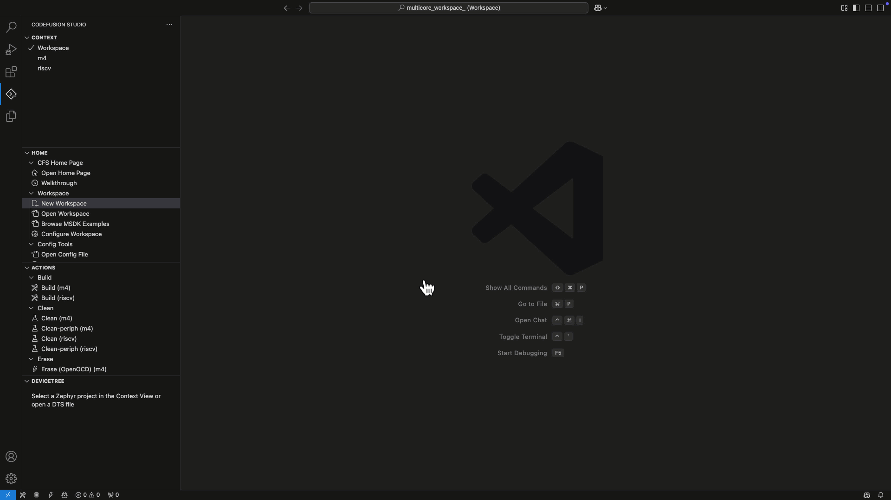
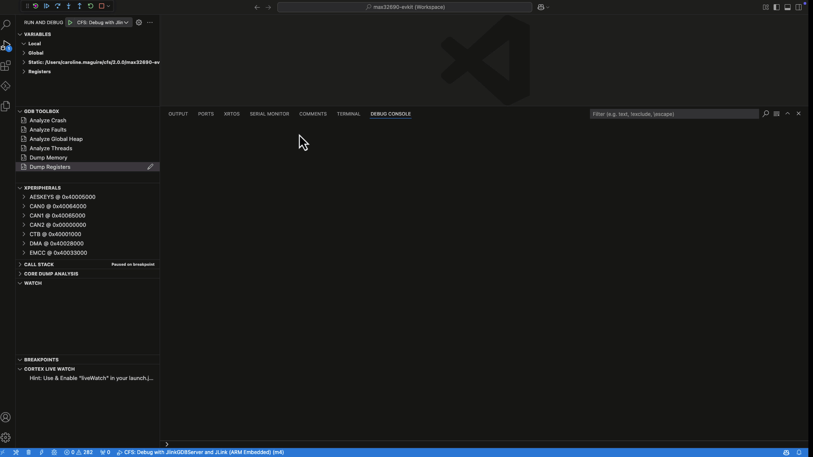
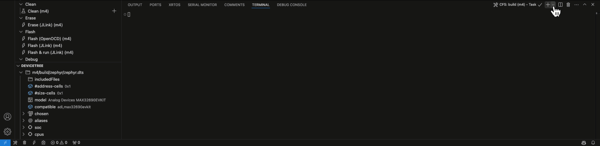

# Features

Explore all the features CodeFusion Studio has to offer.

## System Planner Configuration Tools

Use the System Planner to visually configure every aspect of your system — from memory and peripheral allocation to pin and clock behavior — and generate ready-to-build source code in one step.

[Learn more →](../tools/config-tool/index.md)

## Embedded AI Tools

Build and optimize AI models directly inside your embedded workflow. Use the Embedded AI Tools in System Planner to import models, assign them to cores, validate compatibility, and generate deployment-ready source code.

[Learn more →](../tools/config-tool/manage-ai-models.md)

## Workspace Creation Wizard

Start new single- or multi-core projects in seconds with guided setup, example templates, and optional TrustZone® configurations.

[Learn more →](../workspaces/create-new-workspace.md)

## Heterogeneous multi-core debugging

CodeFusion Studio provides an extended debugging ecosystem for multi-core systems with breakpoints, disassembly, cross-core support, and RTOS thread awareness.

[Learn more →](../debugging/index.md)

## Debugging and analysis tools

Inspect, automate, and analyze your system behavior with built-in debugging and analysis utilities — including multi-core debugging, the Core Dump Analysis Tool, the GDB Toolbox, and the [Zephelin profiler](../tools/config-tool/profiling.md).

[Learn more →](../debugging/debug-tools/index.md)

## Platform agnostic architecture

CodeFusion Studio uses an extensible plugin architecture that separates configuration and design capture from code generation, allowing you to choose RTOS, middleware, and firmware platforms.

Each supported platform (Zephyr, MSDK, SHARC-FX) exposes its own adjustable configuration options in the GUI, providing context-aware settings specific to the selected core and firmware platform.  

These settings are stored in structured JSON files and converted into buildable source code through command-line plugins — enabling automation, reproducibility, and CI/CD integration.

[Learn more →](../plugins/index.md)

## Package and plugin management

Download SDKs, toolchains, and plugins on demand with the integrated Package Manager to keep your environment modular, current, and compatible across supported architectures.

[Learn more →](../installation/package-manager/index.md)

## ELF file explorer

[ELF File Explorer](../tools/elf-file-explorer.md) provides a graphical interface to help understand and analyze the contents of ELF files.

Visualize memory usage, run SQL queries to inspect symbols, and browse segments, sections, and symbols with the interactive memory map.

[Learn more →](../tools/elf-file-explorer.md)

