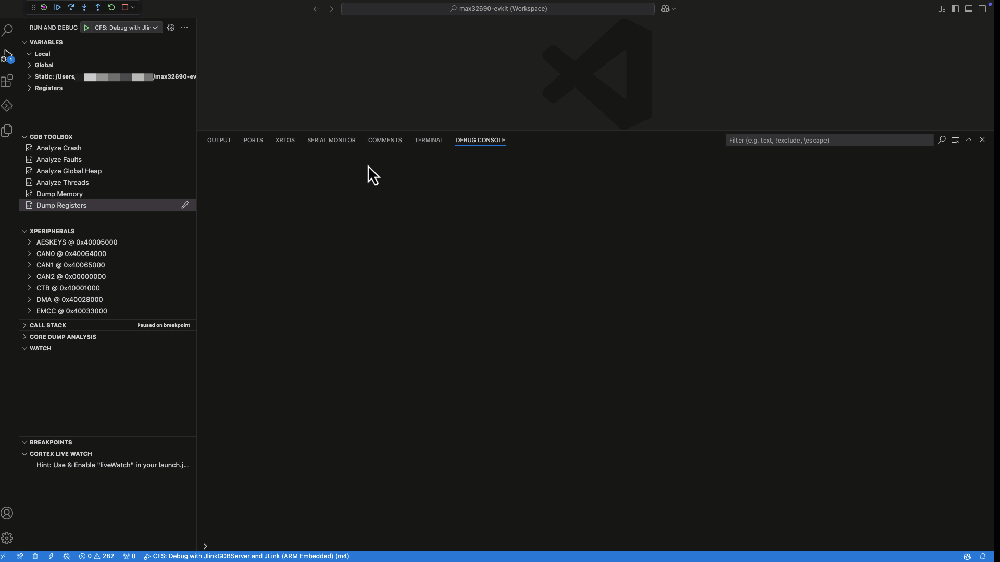
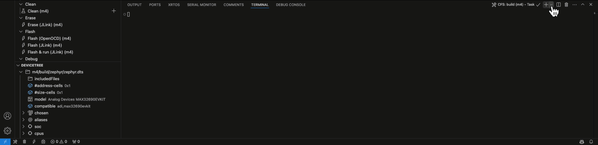

# Features

Explore all the features CodeFusion Studio has to offer.

## Embedded AI Workflows

Complete model-to-deployment workflow for AI on embedded hardware. Create AI-ready workspaces directly from model files with automatic compatibility checking. Import models, validate compatibility with ADI processors, profile runtime performance, and generate optimized inference-ready code. Use the GUI or `cfsutil` commands.

[Create workspace from AI model →](../workspaces/create-workspace-from-ai-model.md) | [AI model tools →](../tools/manage-ai-models.md)

## AI Debug Assistant (Preview)

Investigate faults, inspect hardware state, decode fault registers, and coordinate across multiple cores during live debug sessions using natural language, with support for GitHub Copilot and other AI clients via the Model Context Protocol (MCP).

[Learn more →](../debugging/debug-tools/ai-debug-assistant/index.md)

## System Planner

Use the System Planner to visually configure every aspect of your system — from memory and peripheral allocation to pin and clock behavior — and generate ready-to-build source code in one step.

[Learn more →](../tools/index.md)

## Debugging and Analysis

Inspect, automate, and analyze your system behavior with built-in debugging and analysis utilities — including multi-core debugging, the Memory Viewer, the Core Dump Analysis Tool, the GDB Toolbox, and the [Zephelin profiler](../tools/profiling.md).

[Learn more →](../debugging/debug-tools/index.md)

## Multi-core Debugging

CodeFusion Studio provides an extended debugging ecosystem for multi-core systems with breakpoints, disassembly, cross-core support, and RTOS thread awareness.

[Learn more →](../debugging/index.md)

## CLI-First Development

Build, flash, and configure workspaces entirely from the command line with `cfsutil`. Set up projects without opening the IDE, run complete AI model workflows, manage SDKs and packages, and execute build tasks. Perfect for CI/CD pipelines, automation scripts, and terminal-based workflows.

[Learn more →](../cfsutil/index.md)

## Package Manager

Download SDKs, toolchains, and plugins on demand with the integrated Package Manager to keep your environment modular, current, and compatible across supported architectures.

[Learn more →](../installation/package-manager/index.md)

## Workspace Creation Wizard

Start new single- or multi-core projects in seconds with guided setup, example templates, and optional TrustZone® configurations.

[Learn more →](../workspaces/create-new-workspace.md)

## Plugin-Based Architecture

CodeFusion Studio uses an extensible plugin architecture that separates configuration and design capture from code generation, allowing you to choose RTOS, middleware, and firmware platforms.

Each supported platform (Zephyr, MSDK, SHARC-FX) exposes its own adjustable configuration options in the GUI, providing context-aware settings specific to the selected core and firmware platform.  

These settings are stored in structured JSON files and converted into buildable source code through command-line plugins — enabling automation, reproducibility, and CI/CD integration.

[Learn more →](../plugins/index.md)

## ELF File Explorer

[ELF File Explorer](../developer-tools/elf-file-explorer.md) provides a graphical interface to help understand and analyze the contents of ELF files.

Visualize memory usage, run SQL queries to inspect symbols, and browse segments, sections, and symbols with the interactive memory map.

[Learn more →](../developer-tools/elf-file-explorer.md)

