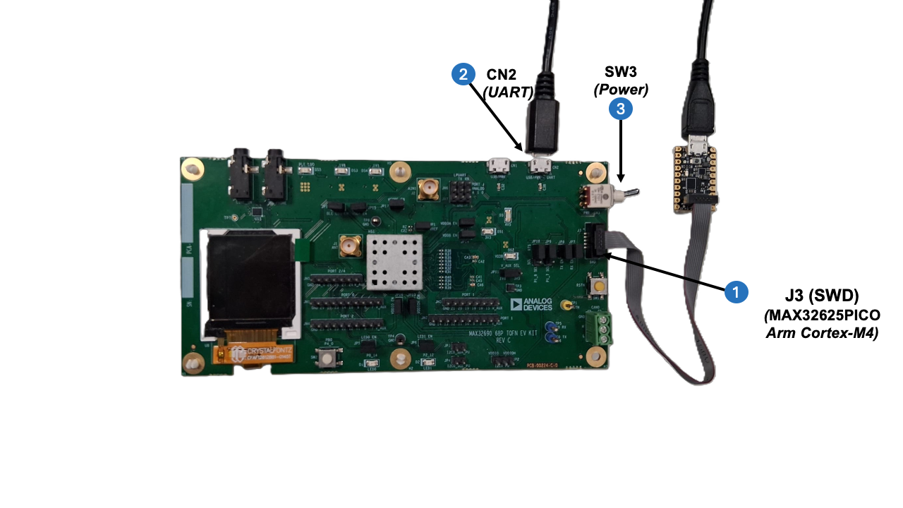
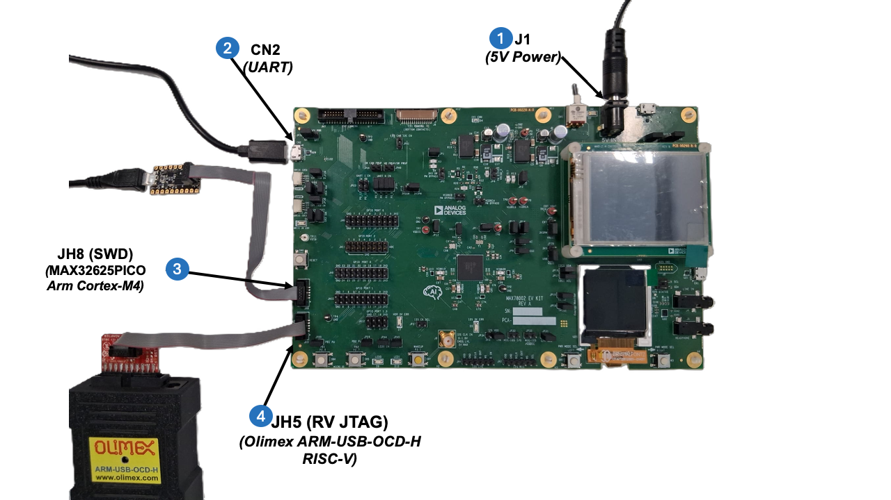
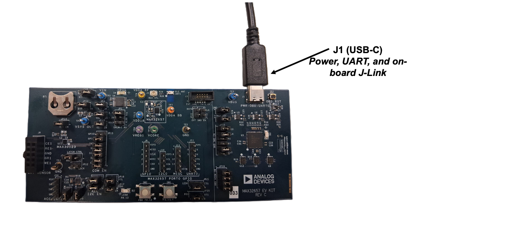
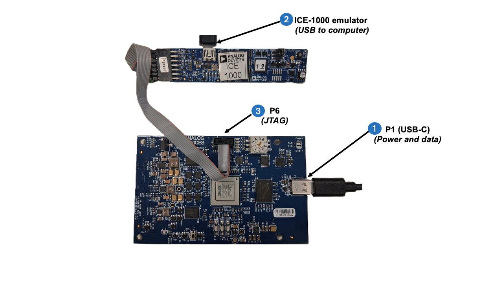

# Connect hardware

This guide shows how to physically connect debuggers and serial cables to Analog Devices development boards. Find your board below for specific connection instructions.

## Before you start

Install the appropriate drivers for your debug probe:

- [Install Segger J-Link drivers](debug-drivers/install-jlink-drivers.md) (for J-Link debuggers)
- [Install ICE drivers](debug-drivers/install-ice-drivers.md) (for SHARC-FX ICE debuggers)
- [Install Olimex drivers](debug-drivers/install-olimex-drivers.md) (for Olimex JTAG probes)

## Board examples

Select your board below for specific connection instructions:

### MAX32690 (MAX32690EVKIT)

**Debug connection:**

- Connect to **J3** (10-pin SWD header)
- Debugger options:
    - Segger J-Link with 10-pin SWD ribbon cable
    - MAX32625PICO debugger with 10-pin SWD ribbon cable

**UART connection:**

- Connect USB cable to **CN2** (USB mini connector)
- Provides serial console output and profiling data

**Setup:**

The numbered labels in the diagram below correspond to the physical connections on the board (steps 1-3). Complete all connections before powering on.

1. Connect external debugger to **J3** (SWD header) using a 10-pin ribbon cable
2. Connect USB-A to Mini-USB cable to **CN2** (UART)
3. Connect debugger to your computer using USB and flip the power switch on the board to ON (board is powered through the CN2 USB connection)
4. Identify the serial port (see [Identify your serial port](#identify-your-serial-port))

### MAX78002 (MAX78002EVKIT)

!!! note "Dual-core board"
    The MAX78002 has two processor cores: Arm Cortex-M4 and RISC-V. If you're debugging or developing for both cores, connect both debuggers. If you're only using one core, you only need to connect the debugger for that core.

**Debug connections:**

- **JH8 (SWD header):** Arm Cortex-M4 core
    - Use MAX32625PICO debugger or Segger J-Link
    - 10-pin SWD ribbon cable
- **JH5 (RV JTAG header):** RISC-V core
    - Use Olimex ARM-USB-OCD-H adapter with ARM-JTAG-20-10 converter
    - Pre-configured for RISC-V debugging
    - Only needed if debugging or profiling on the RISC-V core

**UART connection:**

- Connect USB cable to **CN2** (USB connector)
- Captures serial output from both cores

**Power:**

- Connect 5V power supply to **J1** (power input connector)
- External 5V power required - board is not USB-powered

**Setup:**

The numbered labels in the diagram below correspond to the physical connections on the board (steps 1-4). Complete all connections before powering on.

1. Connect 5V power supply cable to **J1**
2. Connect USB cable to **CN2** (UART)
3. Connect Arm debugger (MAX32625PICO or J-Link) to **JH8** (SWD header)
4. *For dual-core debugging:* Additionally connect RISC-V debugger (Olimex ARM-USB-OCD-H) to **JH5** (RV JTAG)
5. Connect debugger(s) to your computer using USB
6. Turn on the 5V power supply and flip the power switch on the board to ON
7. Identify the serial port (see [Identify your serial port](#identify-your-serial-port))

### MAX32657 (MAX32657EVKIT)

**Debug connection:**

- **On-board J-Link debugger** via USB-C connection to **J1** (default)
- External debugger options:
    - Segger J-Link with 10-pin SWD ribbon cable
    - MAX32625PICO debugger with 10-pin SWD ribbon cable

**UART connection:**

- Connect USB-C cable to **J1** (USB-C connector)
- Provides serial console output, profiling data, and board power

**Setup:**

1. Connect USB-C cable to **J1** and your computer
2. Identify the serial port (see [Identify your serial port](#identify-your-serial-port))

!!! note "Advanced: External debugger"
    For advanced debugging scenarios, you can connect an external J-Link to **J3** (10-pin SWD header). If you experience conflicts with multiple debuggers, you can disable the on-board J-Link by removing the shunt on **JP6**. For details, see [Troubleshooting](troubleshooting.md#max32657-and-max32658-configure-for-an-external-j-link).

### SHARC-FX (ADSP-SC835W with ICE Debugger)

!!! warning "Windows only"
    SHARC-FX debugging is supported only on Windows. See [Debug a SHARC-FX application](debug-sharc-fx.md) for complete requirements.

**ICE emulator connection:**

- Required: ICE-1000, ICE-1500, or ICE-2000 emulator
- Connect ICE emulator to **P6** (JTAG header) using the ICE ribbon cable
- Connect ICE emulator to computer using USB

**Power and data connection:**

- Connect USB-C cable to **P1** (power and data)
- Provides board power and communication with the host computer

**Setup:**

The numbered labels in the diagram below correspond to the physical connections (steps 1-3).

1. Connect USB-C cable to **P1** (power and data)
2. Connect ICE emulator to computer using USB
3. Connect ICE ribbon cable to **P6** (JTAG header on board)

!!! note
    SHARC-FX debugging requires additional configuration including ICE model selection and toolchain setup. For complete instructions, see [Debug a SHARC-FX application](debug-sharc-fx.md).

## Identify your serial port

After connecting the UART cable, identify which serial port your board is using:

**Windows:** Open Device Manager → Ports (COM & LPT) → note the COM port (e.g., `COM3`). Alternatively, run `mode` in Command Prompt or PowerShell to list available serial devices (note that it may not list all devices).

**macOS:** Run `ls /dev/tty.*` in Terminal → look for `/dev/tty.usbserial-*` or `/dev/tty.usbmodem*`

**Linux:** Run `ls /dev/ttyUSB* /dev/ttyACM*` in terminal → look for `/dev/ttyUSB0` or `/dev/ttyACM0`

!!! tip
    Unsure which port? Disconnect the UART cable, note which ports disappear, then reconnect.

## Troubleshooting

**Issue**: Multiple serial ports appear and I'm unsure which to use

- Disconnect the UART cable, note which ports disappear, then reconnect
- Check board documentation for UART port COM number assignment
- Try each port - the correct one will show application output when your program runs

**Issue**: Debug probe not recognized by my computer

- Verify debug probe drivers are installed correctly
- Try a different USB cable or USB port on your computer
- Check that the debug probe has power (look for LED indicators)
- For J-Link, ensure you're using an official Segger probe or compatible clone

**Issue**: Can't see serial port in Device Manager / `/dev/tty.*`

- Verify the USB cable is connected to the UART port, not just the power port
- Some USB cables are power-only and don't carry data - try a different cable
- Check that board is powered on
- On Linux, ensure you have permissions to access serial ports (add user to `dialout` group)
- Driver may be needed for USB-to-UART chip on your board (check board documentation)

**Issue**: Board appears to be stuck or not responding

- Try power cycling the board (disconnect power/USB, wait 5 seconds, reconnect)
- Some boards have a reset button - try pressing it
- Check that you're using the correct power supply voltage (5V vs 3.3V)
- Verify no short circuits or loose connections

## Next steps

With your hardware connected, you can proceed with:

- [Debug an application](debug-an-application.md) - Start an interactive debugging session
- [Deploy and profile an AI model](../workspaces/deploy-and-profile-ai-model.md) - Deploy AI models and capture profiling data
- [View serial output](debug-interface.md#serial-output) - Monitor console output using Serial Monitor tools
