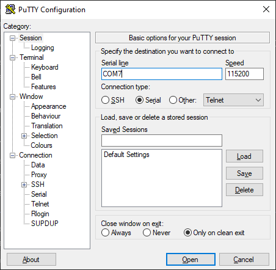
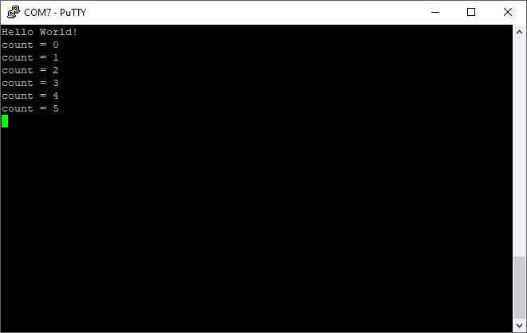

# Debug an application

A default debug configuration is automatically generated with each new project. To manually create or adjust a debug configuration, refer to the [Create New Debug Configuration](#create-new-debug-configuration) and [Modify an Existing Debug Configuration](#modify-an-existing-debug-configuration) sections below.

!!! warning

    Make sure you have a successful build for the core you intend to debug. Each project generates a build directory in the respective project folder. For more information, refer to [CFS build task](../workspaces/tasks.md).

## Supported microcontrollers

See [Supported processors](../about/supported-processors.md) for a full list of supported processors.

## Settings

Debug configuration settings are automatically selected using your CFS workspace settings. Follow the extension prompts for any undefined settings. Adjust settings manually under the **File**  > **Preferences** > **Settings** menu.

When using the **CFS: Debug with GDB and OpenOCD (Arm Embedded)** configuration, CFS automatically searches for and adds the SVD file from the CMSIS Pack directory.
For other parts, the SVD file can be selected manually when prompted.

For more information regarding these settings, refer to [CFS Settings](../workspaces/cfs-settings.md).

## Activate single debug session

1. Select the **Run and Debug** icon on the activity bar.
2. Select the **CFS: Debug with GDB and OpenOCD (Arm Embedded)** from the dropdown menu.
3. Click on the **Start Debugging** Icon to the left of your selection (green play icon) or press **F5**.

For additional information about GDB, refer to the [GDB Basics](../../tutorials/gdb-tutorial/gdb-basics.md).


!!! tip

    To activate the previously utilized debug configuration, click the **CFS:Debug** icon on the left status bar.

## Create new debug configuration

New debug configurations can be created using the following steps:

1. Click the **Run** tab, and select **Add Configuration...**

2. Select the appropriate debugger.

    !!! tip

        For CMSIS devices (such as Cortex-M based targets), the **Cortex Debug** debugger is recommended since it supports peripheral registers using SVD files.

3. Select the debug configuration template matching your target:

    | Supported Targets | Type                                                           |
    | ----------------- | -------------------------------------------------------------- |
    | Cortex-M (CMSIS)  | CFS: Debug with GDB and OpenOCD (Arm Embedded)                 |
    | Cortex-M (CMSIS)  | CFS: Debug with JlinkGDBServer and JLink (Arm Embedded)        |
    | RISC-V            | CFS: Debug with GDB and OpenOCD (RISC-V)                       |

4. Save the `launch.json` file which now contains the chosen debug configuration.

## Modify an existing debug configuration

Use the following steps to modify an existing debug configuration:

1. From the VS Code menu bar, select **Run > Open Configurations**, or open the `.vscode/launch.json` file directly.  
2. Make any necessary edits, then save the file.

   
   

## Debugging interface

Debugging in VS Code is done using the **Run and Debug** View, available in the **Activity Bar** or under **View** > **Open View** and selecting **Run and Debug**.

### Controls

When connected to a debug session, the **Run and Debug** view provides a toolbar to control the application execution. This debugging toolbar contains the following debugging actions:


| Name      | Action                                                             |
|-----------|--------------------------------------------------------------------|
| Reset     | Performs a stop and reload                                         |
| Pause     | Suspends execution to allow debugging                              |
| Step Over | Steps to the next line, stepping over any function calls           |
| Step Into | Steps into any callee functions                                    |
| Step Out  | Steps out of the current function to the calling function          |
| Restart   | Resets the PC to reset address without disconnecting or reloading  |
| Stop      | Terminates execution and closes the debug session                  |

### Variables

The variables view presents all of the variables visible to the current scope and file of debugging.
They are split into different sections for each of use, detailed below.
Double clicking on a value allows you to edit the value, right clicking provides a menu of additional options.

#### Local

Local variables are the variables in the current function scope.


#### Global

Global variables are the variables in the global scope, visible to anywhere in the application.


#### Static

Static variables are shown for the current file being viewed from the current PC or call stack selection.


#### Registers

Registers provides a list of all of the core (non-memory-mapped) registers.


### Watch

Allows you to set expressions which are evaluated. These can be simple variables or complex statements.
!!! warning
    Expressions aren't context aware, so viewing a local variable from another context will fail to evaluate.
    Expressions can set variable values, which will happen each time the expression is evaluated (on step or pause).


### Call stack

Displays the current call stack, with function name, PC address and source information where known.
Selecting a function in the call stack will show the registers and local variables applicable to that function.


### Breakpoints

Breakpoints allow you to pause execution at a specific line of code and inspect program behavior.

To view all set breakpoints, toggle them on/off, or add new ones, open the breakpoints view in the **Run and Debug** view.

Right-click on a breakpoint to access a list of available actions.


#### Line breakpoints

Line breakpoints pause execution at the beginning of a specific line in the source code, allowing you to inspect variables, step through execution, and debug effectively.

To set a breakpoint, click on the left margin of the editor next to the line number where you want to pause. A red dot will appear, indicating the breakpoint. Alternatively, right-click in the left margin and select **Add breakpoint**.

#### Conditional breakpoints

Conditional breakpoints allow execution to pause only when a specified condition is met. This is useful when debugging loops or tracking specific variable values.

To create a conditional breakpoint, right click on an existing breakpoint, select **Edit breakpoint**, choose **Expression**, and enter your condition.


#### Inline breakpoints

Inline breakpoints allow execution to stop inside specific expressions within a line of code, such as inside a loop or within method chains. They are useful when you need to debug a particular part of an expression rather than stopping at the start of the line.

To set an inline breakpoint:

1. Click on the exact position where you want to place the inline breakpoint.
1. Go to **Run > New Breakpoint > Inline Breakpoint**. You can also use the shortcut **Shift + F9** (Windows/Linux) or **Cmd + F9** (Mac).
1. The inline breakpoint will now be set at the cursor position.


### GDB Toolbox

The GDB Toolbox provides access to both built-in and user-defined JSON-based scripts that help inspect program state during a halted debug session. You can use it to create GDB scripts that log output, display messages, or save memory and register dumps.  
For additional information, see [GDB Toolbox](../debugging/debug-tools/gdb-toolbox/index.md).

### Core Dump Analysis

The Core Dump Analysis Tool enables post-mortem debugging for supported Zephyr-based projects, such as those running on the MAX32690. When a core dump is retrieved over JTAG (from flash) or UART (from serial log output), the tool displays the state of the program at the time of the crash, including active threads, stack usage, register values, and memory state.
For additional information, see [Core Dump Analysis](../debugging/debug-tools/core-dump-analysis/index.md).

### Peripheral registers

The **XPeripherals** view provides a nested structure of peripheral registers and user-modifiable bits.
Hover over a register or bit to view more information, copy the value to the clipboard or modify the value.
!!! warning
    Some bits are reserved and not provided in the list. Care should be taken when writing to an entire register that any reserved bits are not set.

### Memory

The **Memory** tab in the toolbar above the terminal shows the working memory. This displays a detailed image of what is currently being stored in memory as the program executes.

  
  

#### Customizing the memory view

To view a specific region of memory, click on the **+** icon and enter a memory address.

To customize that memory view, click on the pencil icon which will allow you to change the address, display name, width and endianness:

  
  

### Disassembly view

Right-click on the main program being executed in the **Call Stack** view and select **Open Disassembly View** to view details of the machine-level instructions corresponding to the source code during a debugging session.

!!! note

    Stepping while this view is in focus performs a single assembly instruction step.

  
  

### Serial output

#### Tera Term

Tera Term is a free, open-source terminal emulator commonly used to capture UART serial output from embedded systems. To capture UART output in Tera Term:

1. Install [:octicons-link-external-24: Tera Term](https://github.com/TeraTermProject/teraterm/releases).
2. Launch Tera Term and select the correct **COM port** (such as COM5).
3. Go to **Setup > Serial port**, and set the **baud rate** to `115200`.
4. Click **OK** and view the log output in the terminal window.

#### Minicom

[Minicom](https://help.ubuntu.com/community/Minicom) is a command line utility for serial port communication on Unix platforms.

!!! note
    You will need **minicom** if not already installed.

1. Run the following from a terminal:

    `$ minicom -D /dev/tty.usbxxx -b 115200`

    where `/dev/tty.usbxxx` matches your serial device.

!!! example

    When using the example "Hello World" program, the output looks like this:

    ```
    Welcome to minicom 2.9

    OPTIONS:
    Compiled on Sep 22 2023, 21:10:41.
    Port /dev/tty.usbmodem21302, 10:07:03

    Press Meta-Z for help on special keys

    Hello World!
    count = 0
    count = 1
    count = 2
    count = 3
    count = 4
    count = 5
    ```

#### PuTTY

[PuTTY](https://www.putty.org/) is an open source SSH and telnet client for Windows.

!!! note
    You will need **PuTTY** if not already installed.

1. In the **Session** category, select **Serial** as the **Connection type**.
2. Set the **Serial line** to the correct COM port for your device. Use the Windows **Device Manager** to find your device under **Ports (COM & LPT)**.
3. Set the **Speed** (baud rate) to **115200**.
4. Click **Open** to start the serial terminal.

    

!!! example

    When using the example "Hello World" program, the output looks like this:

    

#### VS Code Serial Monitor

!!! warning

    Arm CMSIS-DAP debuggers, including the MAXPICO and MAX32xxxx onboard debuggers, use the serial `Break` to trigger a target reset.
    Microsoft's Serial Monitor in VS Code sends the `Break` before connecting to the serial port, which causes the processor to reset when using these debuggers. J-Link debuggers do not exhibit this behavior.
    It is recommended to connect to the serial port before starting a debug session, or use an external serial terminal like [Minicom](#minicom) or [PuTTY](#putty).

!!! note
    You will need to install the **Serial Monitor** extension for VS Code if it is not already installed.

1. Click on **Serial Monitor** in the toolbar above the terminal.
2. Set the Monitor Mode to **Serial**.
3. Set the Port to the port in use by the hardware.
4. Set the Baud rate to **115200**
5. Click **Start Monitoring**. This prints the outputs associated with the source code.

!!! info
    To determine the correct port, view the available ports with the required port disconnected, connect the port and see which value appears in the dropdown list

!!! example

    When using the example "Hello World" program, the output looks like this:

    
    

#### Linux configuration

On Linux the user may need to be added to the **dialout** group in order to use your serial ports.

``` bash
    sudo usermod -aG dialout <username>
```

### RTOS status

When running an RTOS like Zephyr, you can view essential thread information for the RTOS at a breakpoint using the **XRTOS** tab.

  
  

#### RTOS requirements

Some RTOSes may require changes in order to provide the debug information required by the XRTOS View.  

For **Zephyr**, the following config flags must be enabled in your prj.conf file:

``` kconfig
# Enable thread awareness when debugging
CONFIG_THREAD_NAME=y
CONFIG_DEBUG_THREAD_INFO=y
CONFIG_THREAD_ANALYZER=y
```

Other RTOSes will have their own required config flags. Please consult the relevant documentation for configuration information.

!!! note
    You will need the **RTOS Views** extension for VS Code if not already installed.
