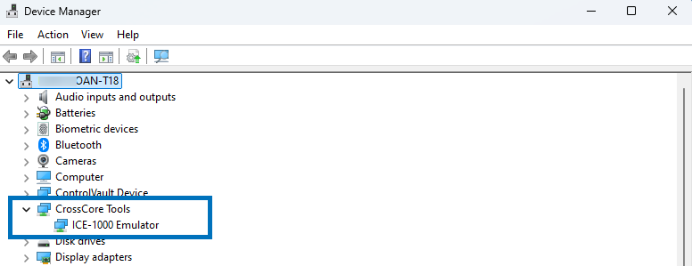

# Debug a SHARC-FX application

Use this guide to connect, configure, and debug SHARC-FX processors in CodeFusion Studio. The SHARC-FX family includes both single-core DSPs (such as the ADSP-2183x series) and multicore SoCs (such as the ADSP-SC83x family) that combine a SHARC-FX DSP with an ARM Cortex-M33 core.

Most of the setup steps, including toolchain installation and ICE emulator configuration, apply to all SHARC-FX devices. For single-core DSPs, debugging is performed directly on the SHARC-FX core. For multicore SoCs, the debugging process requires starting the SHARC-FX core before attaching to the ARM core.

!!! warning "Windows only"
    The SHARC-FX toolchain and related workspace plugins are **supported only on Windows**.  
    Proceed only if you are using a Windows host system.

## Before you start

1. Install ADI ICE drivers.
    Ensure the ICE-1000, ICE-1500, or ICE-2000 drivers are installed so CodeFusion Studio can communicate with your SHARC-FX target.  
    - If you selected **ADI ICE Drivers (Requires Administrator)** during CodeFusion Studio installation, you’re all set.  
    - If you skipped that option, see [Install ICE drivers manually](install-ice-drivers.md).
2. Sign in to the Package Manager and install the required SHARC-FX toolchain.

### Step 2 – Log in to access the SHARC-FX toolchain

Authentication is required to download the SHARC-FX toolchain.

1. Follow the steps in [Access restricted packages (using myAnalog login)](../installation/package-manager/auth.md).
2. Install the toolchain using one of the following methods:
      - **Command Palette:** Open the Command Palette and run **CFS: Install Required Packages**. Find `xtensa_sharcfx_toolchain/15.4.0` in the list and click to install.
      - **Command line:** From `cfsutil`, run

        ```sh
        cfsutil pkg install xtensa_sharcfx_toolchain/15.4.0
        ```

## Create a SHARC-FX workspace

1. Follow the steps in [Create a new workspace](../workspaces/create-new-workspace.md) to launch the Workspace Creation Wizard.
2. Select a SHARC-FX device, such as the **ADSP-SC835W** SoC and corresponding **ADSPSC835W-EV-SOM** board.
3. Choose a SHARC-FX workspace template, such as **SHARC-FX Multi-Core with TFLM running on the ARM core**.
4. Follow the prompts to complete workspace setup.

## Connect the ICE emulator

The ICE-1000, ICE-1500, or ICE-2000 emulators are required for JTAG debugging on all SHARC-FX projects.

Follow the recommended setup for your ICE emulator:

1. Connect the emulator and board:
      - Attach the main power/data cable from the ADSP-SC835W board to your computer.
      - Attach the main USB cable from the ICE emulator to your computer.
      - Connect the emulator ribbon cable (ICE-1000, ICE-1500, or ICE-2000) to the board’s JTAG header.
      - Verify that both the board and emulator LEDs flash green, indicating that the hardware is powered and communication is established.
2. Open **Windows → Device Manager** and confirm that the emulator appears under CrossCore Tools:

    

3. By default, CodeFusion Studio templates use the **ICE-2000** interface. If you are using a different model, update the `.vscode/settings.json` for each project accordingly:

    ```json
    "cfs.openocd.interface": "interface/ice1000.cfg"
    ```

4. If you are using and ICE-1000 and ICE-1500 emulator, the value of adapter speed in `.vscode/launch.json` should also be updated in the SHARC-FX project. For ICE-1000 and ICE-1500, the maximum speed is 5000:

    ```json
    "openOCDLaunchCommands": ["adapter speed 5000"],
    ```

!!! note
    For additional information on installing the emulator hardware and software on your PC, see the [:octicons-link-external-24: ICE-1000/ICE-2000 Emulator User’s Guide (PDF)](https://www.farnell.com/datasheets/1880733.pdf){:target="_blank"}.

## Build the projects

Run the [CFS: build](../workspaces/tasks.md) to create the build directory and generate the ELF files needed for debugging.

- Click the **CFS icon**   in the **Activity Bar**.
- In the **Actions** view, select the appropriate build task for your project:
    - Select **Build (m33)** and **Build (sfx)** for multicore SHARC-FX SoCs.
    - Select **Build (sfx)** for single-core SHARC-FX SoCs.

## Start debugging

The steps below apply to multicore SHARC-FX SoCs such as the ADSP-SC83x family. For **ADSP-SC83x** projects, debugging on the ARM core works only if the SHARC-FX core is started first, then the ARM debug session is started.

If you are using a single-core SHARC-FX DSP, start a standard debug session for the SHARC-FX project only.

To start debugging:

1. Select the **Run and Debug** icon on the activity bar.
2. Select the **Debug with GDB and OpenOCD (sfx)** from the dropdown menu.
3. Click on the **Start Debugging** icon (green play button) to the left of your selection or press **F5**. This will load and run the preload application, which will configure clocks and DMC settings. The main application can then be loaded and run by clicking on the Reset device icon.
4. When the SHARC-FX debug session starts and the core halts at `main()`, leave it running.
5. Launch the ARM debug instance using the **Debug with GDB and OpenOCD (ARM)** debug configuration.

!!! note
    During an active debug session, the ICE emulator LED changes to purple, indicating that it is connected and debugging.

## Troubleshooting

| **Error Message**                                                                                                        | **Solution**                                                                     |
|--------------------------------------------------------------------------------------------------------------------------|----------------------------------------------------------------------------------|
| `Failed to launch GDB: could not connect (error 138): The system tried to join a drive to a directory on a joined drive` | Start debugging with the SHARC-FX core first.                                    |
| `Cannot find: "C:/analog/cfs/2.0.0/Tools/xtensa/RJ-2024.4/XtensaTools"`                                                  | Ensure you install the Xtensa toolchain package.                                 |
| `OpenOCD: GDB Server Quit Unexpectedly.`                                                                                 | Update the `.vscode/settings.json` for each project with the correct ICE emulator model |
