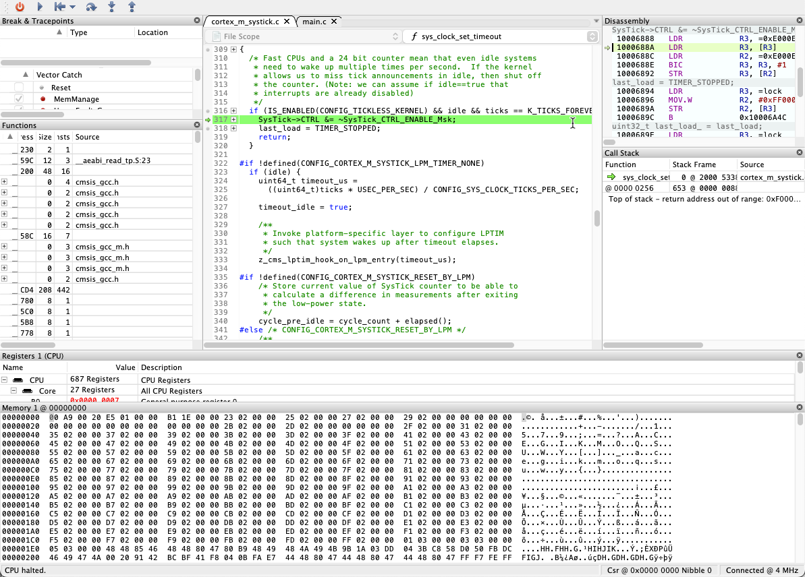

# Debug with SEGGER Ozone

SEGGER Ozone is a graphical debugger for embedded applications that provides advanced debugging features, including instruction trace, code profiling, and performance analysis. CodeFusion Studio can launch Ozone debugging sessions directly from the Actions panel, with automatic project configuration through generated `.jdebug` files.

CodeFusion Studio supports Ozone debugging for supported Arm Cortex-M targets, including MAX32xxx, MAX78xxx, and the Cortex-M33 core on SHARC-FX devices. It supports MSDK and Zephyr projects.

## Prerequisites

Before using Ozone with CodeFusion Studio, ensure the following are installed:

- **SEGGER J-Link drivers**: Required for J-Link hardware probe support. See [Install Segger J-Link drivers](debug-drivers/install-jlink-drivers.md).
- **SEGGER Ozone**: Download and install Ozone from the [:octicons-link-external-24: SEGGER website](https://www.segger.com/products/development-tools/ozone-j-link-debugger/){:target="_blank"}.
- **Built project**: Ozone requires a generated ELF file in the project build folder, for example `build/m4.elf`. For information on how to build a project, refer to [CFS build task](../build-and-flash/tasks.md).

## Configure Ozone executable path (optional)

CodeFusion Studio automatically detects the Ozone executable when installed in standard locations. If auto-detection doesn't work, or if Ozone is installed in a custom location, you can manually configure the path:

1. Open VS Code **Settings** (`Ctrl+,` on Windows/Linux, `⌘,` on macOS).
2. Search for `cfs.ozone.executable`.
3. Set the **CFS Ozone Executable** path to your Ozone installation. Typical installation paths:

    - **Windows:** `C:\Program Files\SEGGER\Ozone_V<version>\Ozone.exe`
    - **macOS:** `/Applications/SEGGER/Ozone_V<version>/Ozone.app`
    - **Linux:** `/opt/SEGGER/Ozone_V<version>/Ozone`

    !!! note "macOS application bundles"
        On macOS, you can specify either the `.app` bundle path (for example, `/Applications/SEGGER/Ozone_V340i/Ozone.app`) or the full path to the executable inside the bundle (for example, `/Applications/SEGGER/Ozone_V340i/Ozone.app/Contents/MacOS/Ozone`). CodeFusion Studio automatically handles `.app` bundle paths and locates the correct executable.

4. Replace `<version>` with your installed Ozone version (for example, `V340i`).

## Launch an Ozone debug session

CodeFusion Studio generates a `.jdebug` project file for Ozone based on your workspace configuration. This file configures the target device, debug interface, and ELF file path.

### Start debugging with Ozone

1. Connect your J-Link debug probe to your computer and target hardware. See [Connect hardware](connect-hardware.md) for details.
2. Build your project to generate an ELF file in the `build/` directory.
3. Click the **CFS icon**   to open the **CFS Home Page**.
4. Select the core you want to debug from the **Context** dropdown.
5. From the **Actions** panel, click **Debug with Ozone**.

    
    

!!! note
    The **Debug with Ozone** option only appears in the **Actions** panel when a core is selected from the **Context** dropdown.

CodeFusion Studio launches Ozone and loads a debug configuration file (`.jdebug`). Ozone connects to the target hardware, loads the compiled application, and opens the graphical debugging interface. You can now use Ozone debugging features—source code view, breakpoints, register inspection, memory viewer, and instruction trace—to debug your application.

### Debug configuration files

CodeFusion Studio automatically generates a `.jdebug` Ozone project file in your project directory when you create a workspace. This file configures the target device, debug interface, and ELF file path for the debug session.

CodeFusion Studio names the file based on the core name (for example, `m4.jdebug`). You can use the generated `.jdebug` file without modification.

## Additional information

- [:octicons-link-external-24: Ozone User Guide & Reference Manual](https://www.segger.com/downloads/jlink/UM08025_Ozone.pdf){:target="_blank"}
- [:octicons-link-external-24: SEGGER J-Link documentation](https://www.segger.com/products/debug-probes/j-link/){:target="_blank"}
- [Install Segger J-Link drivers](debug-drivers/install-jlink-drivers.md)
- [Debug an application](debug-an-application.md)
