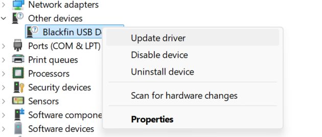
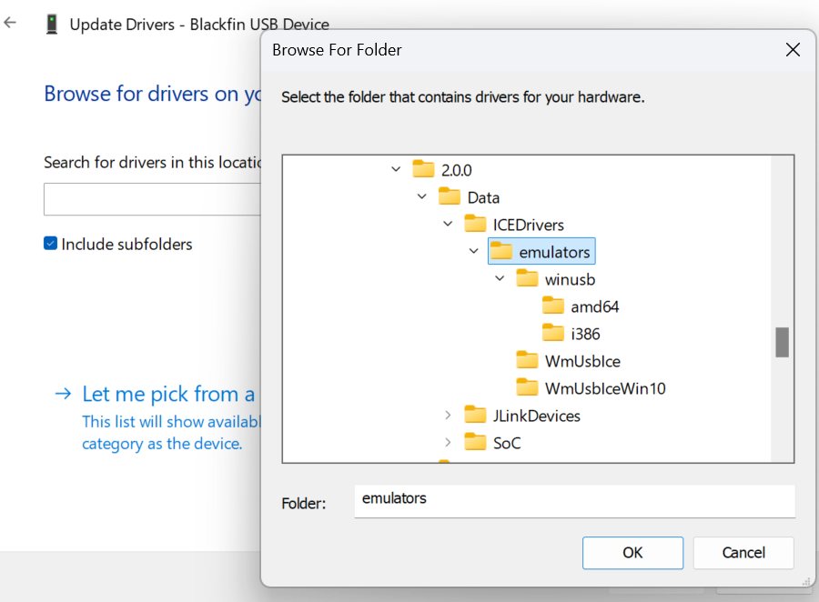
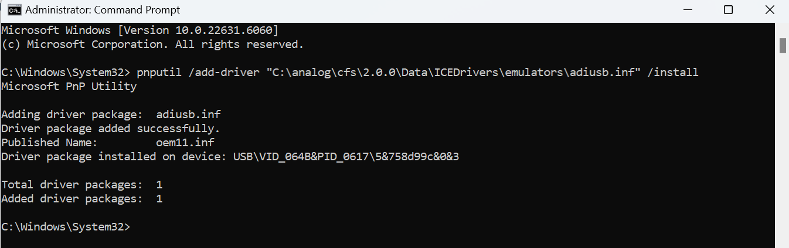

# Install ICE drivers manually (Windows)

If you skipped the **ADI ICE Drivers** option during CodeFusion Studio installation, follow these steps to complete the driver installation.  

The ADI ICE drivers are required to debug SHARC-FX processors using the ICE-1000, ICE-1500, or ICE-2000 emulator.

## Before you start

1. Connect your ICE probe (**ICE-1000**, **ICE-1500**, or **ICE-2000**).
2. Open Windows **Device Manager** using one of the following methods:

      - Search for **Device Manager** in the **Start** menu.
      - Right-click the **Start** button and select **Device Manager**.
      - Press **Windows + R**, type `devmgmt.msc`, and press **Enter**.

3. Identify the ICE probe in Device Manager. The ICE probe uses a Blackfin processor internally. Windows may identify the device as **Blackfin** or **Unknown USB Device**, depending on your USB port and system configuration.  

  
*ICE-1000 and ICE-2000 probes may appear as **Blackfin** under **Other devices** before driver installation.*

  
*ICE-1500 (and occasionally other ICE models) may appear as **Unknown USB Device** before the driver is installed.*

## Option 1: Install using Device Manager (recommended)

1. **Right-click** the device entry and choose **Update driver**.  
   

2. Select **Browse my computer for drivers**.

3. In the **Browse for drivers on your computer** dialog:

      - Make sure **Include subfolders** is selected.  
      - Navigate to: `C:\analog\cfs\2.0.0\Data\ICEDrivers\emulators`

      

4. Click **OK**, then click **Next** to start the installation.

5. Wait while Windows installs the driver. When installation completes:  

      - The wizard displays **Windows has finished installing the drivers for this device.**  
      - The LED on the ICE probe lights up.
      - In **Device Manager**, the probe now appears under CrossCore Tools.

      

## Option 2: Install using the Windows CLI (`pnputil`)

`pnputil` is a built-in Windows command-line tool that manages device drivers. You can use it to install the ICE driver directly.

1. Open **Command Prompt** as Administrator.  
2. Run the following command:

      ```bash
      pnputil /add-driver "C:\analog\cfs\2.0.0\Data\ICEDrivers\emulators\adiusb.inf" /install
      ```

3. Wait for the confirmation message:

      

4. When installation completes:  
      - The **LED on the ICE probe lights up.**  
      - In **Device Manager**, the probe now appears under **CrossCore Tools.**

## Next steps

Once the driver installation is complete, you can [connect and debug SHARC-FX targets](debug-sharc-fx.md) directly from CodeFusion Studio.
