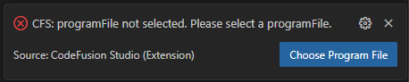

# Troubleshooting

## Debugging

- Failure to select an option from the quick pick menu results in the debug session ending and an error notification allowing you another opportunity to set the required setting from a quick pick menu:

```{admonition} Example

```

- No SVD Files present in the CMSIS Pack directory results in an error notification allowing you to browse your file directory for an SVD File:

```{admonition} Example

```

## Serial monitor

- **Failed to open serial port** on Linux
The user may need to be added to the **dialout** group in order to manipulate the serial port.

```bash
sudo usermod -aG dialout <username>
```
