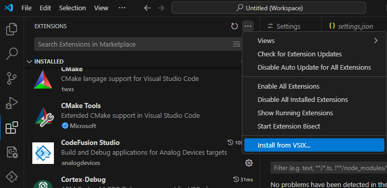
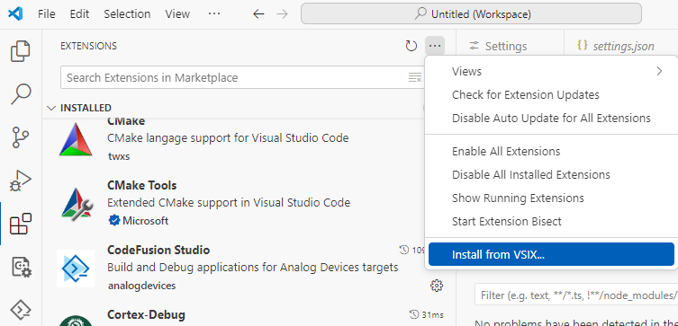

# Manually install the VS Code extension

```{note}
The VS Code extension can be installed from the [Visual Studio Marketplace](https://marketplace.visualstudio.com/items?itemName=AnalogDevices.cfs-ide). However, if you are unable to install it due to firewall restrictions or offline environments, you can manually install it using the VSIX file.
```

To manually install the extension, locate the CodeFusion Studio VS Code extension VSIX file in the VS Code directory within the CodeFusion Studio installer.

1. Open Visual Studio Code.
2. Select the **Extensions** icon from the activity bar.
3. Click **Views and More Actions** (...) and select **Install from VSIX**.
4. Navigate to the `<codefusion-sdk-install>/VSCode` directory.
5. Select the `cfs-ide-*.vsix` file to install.
6. Restart VS Code for the changes to take effect.

{.only-dark}
{.only-light}
