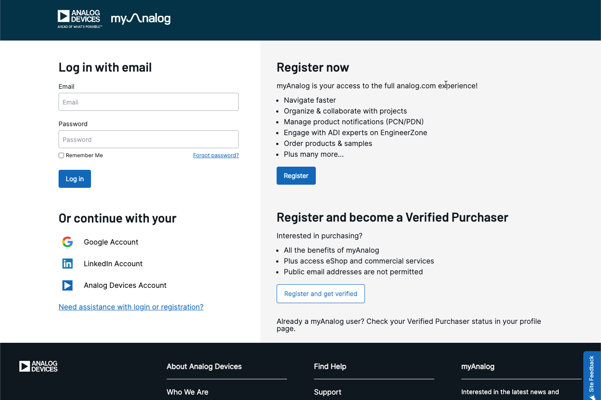

# Access restricted packages (using myAnalog login)

Some components in CodeFusion Studio are distributed as restricted packages. To access restricted packages, a **myAnalog** account is required.

If you don’t already have a myAnalog account, you can create it at [:octicons-link-external-24: analog.com/myAnalog](https://www.analog.com/myAnalog){:target="_blank"}.

!!! note
    Access to some packages is restricted to authorized users. If you believe you should have access but cannot see the required packages, contact your account representative.

## Option 1: Login with myAnalog from VS Code Command Palette

1. Open the VS Code **Command Palette** using the **Manage** gear icon or the keyboard shortcut (`Ctrl+Shift+P` or `Cmd+Shift+P` on macOS).
2. Type `CFS myAnalog login`.

    

3. A dialog will prompt you to open an external website.
4. Click **Open**.
5. Log in with your account credentials.
    
6. When prompted, close the browser window and return to VS Code.
7. A VS Code notification confirms you are logged in.

!!! note
    You can also check or end your session at any time from the command palette. Use `CFS myAnalog status` to check if you’re logged in. Use `CFS myAnalog logout` to sign out.

## Option 2: Login from the command line `cfsutil`

Log in directly from the terminal using `cfsutil`.

1. To access `cfsutil`, open a new terminal (**View > Terminal** or `Ctrl+``).
2. In the terminal panel, click the dropdown arrow next to the **+** icon.
3. Select **CFS Terminal** from the list.
4. Run the following command: `cfsutil auth login`
    
5. Log in with your account credentials.
    
6. When prompted, close the browser window and return to VS Code.

!!! note
    You can also check or end your session at any time from the terminal. Use `cfsutil auth status` to check if you’re logged in. Use `cfsutil auth logout` to sign out.

!!! note
    To run `cfsutil` from a system terminal outside VS Code, use its full installation path — for example, `<CFS-Install>/Utils/cfsutil/bin/cfsutil.cmd` on Windows, or `<CFS-Install>/Utils/cfsutil/bin/cfsutil` on Linux and macOS.

## Next steps

Now that you are logged in, you can proceed to install packages in CodeFusion Studio.
Choose your preferred method below:

- To install packages from the Command Palette, see [Manage packages from VS Code Command Palette](manage-packages-command-palette.md).
- To install packages using the command line, see [Manage packages from the command line (`cfsutil`)](manage-packages-cfsutil.md).
