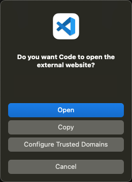

# Access restricted packages (using myAnalog login)

Some components in CodeFusion Studio are distributed as restricted packages. These packages are available through additional package remotes, and may require you to authenticate with your myAnalog account before they can be installed.

If you don’t already have a myAnalog account, you can create it at [:octicons-link-external-24: analog.com/myAnalog](https://www.analog.com/myAnalog){:target="_blank"}.

!!! note
    Access to some packages is restricted to authorized users. If you believe you should have access but cannot see the required packages, contact your account representative.

## Login to myAnalog

Before adding the package remote, you must first log in to myAnalog.

!!! tip
    If you've logged in before, you can check your login status with:

    - **Command Palette:** `(CFS) myAnalog Status`
    - **CLI:** `cfsutil myanalog status`

### Option 1: From the Command Palette

1. Open the **Command Palette** from the **Manage** gear icon or using the keyboard shortcut (`Ctrl+Shift+P` or `Cmd+Shift+P` on macOS).
    
    
2. Type `(CFS) myAnalog Login` and press Enter, or select it from the list.
    
    
3. Click **Open** to launch the browser. If the browser does not open, use the **Copy** button to copy the link and paste it in your browser.

    

4. On the myAnalog login page, under **Or continue with your**, choose **Analog Devices Account** and, if prompted, enter your Analog Devices credentials to complete the login process.
    
5. When the **Sign-in Successful** page appears, close the browser and return to VS Code.
6. A VS Code notification confirms you are logged in. Next, proceed to [Add the package remote using the Command Palette](#option-1-add-remote-from-the-command-palette).

    
    

### Option 2: From the command line `cfsutil`

To access `cfsutil`, open a new terminal (**View > Terminal** or ``Ctrl+` ``).

!!! note
    If you want to run `cfsutil` from a system terminal outside VS Code, refer to the note in the **Add the package remote** section below for the executable path to use on your platform.

Complete the following steps:

1. In the terminal panel, click the dropdown arrow next to the **+** icon.
2. Select **CFS Terminal** from the list.
    
    
3. Authenticate using your myAnalog account. A browser opens automatically.

    ```bash
    cfsutil myanalog login
    ```

4. On the myAnalog login page, under **Or continue with your**, choose **Analog Devices Account** and, if prompted, enter your Analog Devices credentials to complete the login process. If the browser does not open, copy the authentication link from the terminal and paste it into your browser manually.
5. When the **Sign-in Successful** page appears, close the browser and return to VS Code. Next, proceed to [Add the package remote using the command line](#option-2-add-remote-from-the-command-line-cfsutil).

!!! important
    For session-expiration and reauthentication guidance, see [Restricted packages not appearing](troubleshooting-package-manager.md#restricted-packages-not-appearing).

## Add the package remote

Restricted packages require a custom package remote to be added. Your organization provides the remote name and URL as needed.

### Option 1: Add remote from the Command Palette

1. Open the **Command Palette** from the **Manage** gear icon or use the keyboard shortcut (`Ctrl+Shift+P` or `Cmd+Shift+P` on macOS).
    
    
2. Type `(CFS) Add Custom Package Remote` and press Enter, or select it from the list.  
    
    
3. Add the remote name and URL.
4. Choose **myAnalog** from the list of authentication options. Since you are already logged in, the remote will be linked to your existing myAnalog session.

    
    

    !!! important
        To cancel or restart this process, press **Escape**.

### Option 2: Add remote from the command line `cfsutil`

1. In the terminal panel, click the dropdown arrow next to the **+** icon.
2. Select **CFS Terminal** from the list.
    
    
3. Run the following command to add the remote:

    ```bash
    cfsutil pkg add-remote <remote-name> <url>
    ```

    !!! example

        ```sh
        cfsutil pkg add-remote myserver https://my.server.url
        ```

4. Log in to the remote:

    ```bash
    cfsutil pkg auth-remote <remote-name> --myanalog
    ```

    !!! example

        ```sh
        cfsutil pkg auth-remote myserver --myanalog
        ```

    !!! note "If you haven't logged in yet"
        If you skipped the [Login to myAnalog](#login-to-myanalog) section above, run `cfsutil myanalog login` now and complete the browser authentication before proceeding.

!!! note
    To run `cfsutil` from a system terminal outside VS Code, run the following executable:  

    - **Windows:** `<CFS-Install>/Utils/cfsutil/bin/cfsutil.cmd`.
    - **Linux/macOS:** `<CFS-Install>/Utils/cfsutil/bin/cfsutil`.

!!! important
    Your myAnalog login session may expire after a period of inactivity. If this happens, you will need to reauthenticate to access restricted packages. For more details, see [Restricted packages not appearing](troubleshooting-package-manager.md#restricted-packages-not-appearing).

## Verify your setup

After adding the remote and completing authentication, verify that the remote was added correctly.

Run the following command in the **CFS Terminal**:

```bash
cfsutil pkg list-remotes
```

## Next steps

Now that you are logged in, you can proceed to install packages in CodeFusion Studio.
Choose your preferred method below:

- To install packages from the Command Palette, see [Manage packages from VS Code Command Palette](manage-packages-command-palette.md).
- To install packages using the command line, see [Manage packages from the command line (`cfsutil`)](manage-packages-cfsutil.md).
