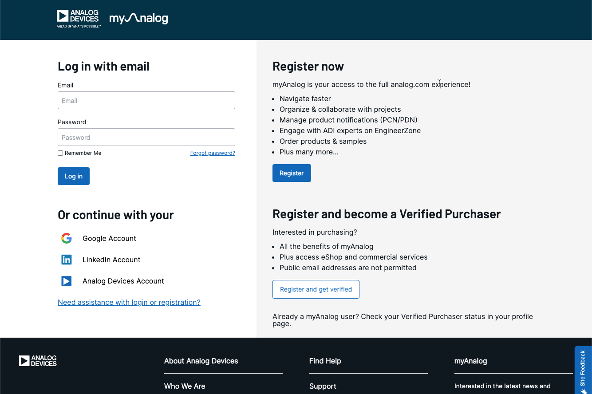

# Package Manager Troubleshooting

Most issues occur when required packages are missing, incompatible, or cannot be downloaded. This page lists common problems and how to resolve them.

Common issues include:

- Package integrity problems
- Restricted packages not appearing  
- Out-of-date authentication sessions
- Incorrect or stale remotes  
- Missing SoCs in the Workspace Creation Wizard

## Package integrity issues

If old or corrupted packages accumulate over time, they can cause Package Manager errors or unexpected behaviour. Use the following steps to clean up your local package state:

1. Remove any unused cached packages from your local storage:

    ```sh
    cfsutil pkg delete "*"
    ```

    This command deletes all cached packages that are not actively installed.

2. Run the following command to view the remaining installed packages.

    ```sh
    cfsutil pkg list
    ```

3. Uninstall any packages you no longer need:

    ```sh
    cfsutil pkg uninstall <package-name>
    ```

4. Run the delete command again to complete the cleanup:

    ```sh
    cfsutil pkg delete "*"
    ```

5. (Optional, last resort) Delete the `com.analog.cfs` directory if issues persist:

    - **Linux:** `~/.local/share/com.analog.cfs`
    - **macOS:** `~/Library/Preferences/com.analog.cfs`
    - **Windows:** `%LOCALAPPDATA%\com.analog.cfs`

    !!! warning
        This removes all installed CFS packages, cached data, and custom remotes. You will need to reinstall required packages.

6. Restart VS Code and reopen Package Manager.

    If you deleted the `com.analog.cfs` directory in step 4, reinstall the required packages using:

    ```sh
    cfsutil pkg install <package-name>
    ```

## Restricted packages not appearing

This usually happens when your myAnalog login session has expired.

### Check login status Command Palette

1. Open the **Command Palette** (`Ctrl+Shift+P` / `Cmd+Shift+P` on macOS).
2. Run `(CFS) myAnalog Status`.

    
    

If you are logged out:

1. Run the `(CFS) myAnalog Login` command in the **Command Palette**.

    
    

2. Click **Open** to launch the browser. If the browser does not open, use the **Copy** button to copy the link and paste it in your browser.
3. On the myAnalog login page, under **Or continue with your**, choose **Analog Devices Account** and, if prompted, enter your Analog Devices credentials to complete the login process.

    

4. When the **Sign-in Successful** page appears, close the browser and return to VS Code.
5. A VS Code notification confirms you are logged in.

### Check login status (command line)

1. Check your login status:

    ```bash
    cfsutil myanalog status
    ```

2. If your session has expired, log in again:

    ```bash
    cfsutil myanalog login
    ```

3. (Optional) View all configured remotes:

    ```bash
    cfsutil pkg list-remotes
    ```

## Remote management issues

If downloads fail or restricted packages disappear unexpectedly, a remote may be misconfigured.

To manage remotes:

1. Open the **Command Palette**.
2. Run `Manage Package Remotes`.
3. Highlight a remote to:
    - Log out and log in again (reauthenticate)
    - Remove the remote
    - Add it again

    
    

## Missing SoC in the Workspace Creation Wizard

If you install a new SoC package (for example, using `cfsutil pkg install`) but the SoC does not appear in the [Workspace Creation Wizard](../../workspaces/create-new-workspace.md), the catalog may be out of date or missing entries. The catalog determines which SoCs and templates are shown in the wizard.

Follow these steps in order.

1. Run the following command to ensure the package containing the required SoC is installed:

    ```sh
    cfsutil pkg list
    ```

    If it is missing, reinstall the package and try again.

2. Restart VS Code and reopen CodeFusion Studio to refresh the catalog. The Workspace Creation Wizard may not update immediately after installing a package.

3. Make sure catalog updates are enabled.

    - Open **VS Code Settings**.
    - Search for `cfs.catalogManager.checkForUpdates`.
    - Make sure this option is enabled so the catalog can refresh when CFS checks for updates.

      
    

4. If the new SoC is from a restricted package, make sure you are logged in with your myAnalog account. See [Restricted packages not appearing](#restricted-packages-not-appearing) for login steps.

5. (Optional, last resort) Delete the local catalog and restart if the SoC still does not appear:

    1. Close VS Code.
    2. Delete the local catalog file:

        - **Linux:** `/home/<username>/cfs/<version>/.catalog`
        - **macOS:** `/Users/<username>/cfs/<version>/.catalog`
        - **Windows:** `C:\cfs\<version>\.catalog`

    3. Restart VS Code. The catalog file is recreated automatically on startup.
    4. If required, log in again with your myAnalog account.
    5. Open the **Workspace Creation Wizard** and verify that the new SoC is now listed.

## Still having issues?

If you continue to experience problems:

- Double-check your login status and remotes.
- Try logging in from a different network or device.
- Contact your account representative, visit ADI Engineer Zone to ask a question or submit a technical support request. For details, see [Help](../../about/help.md).
