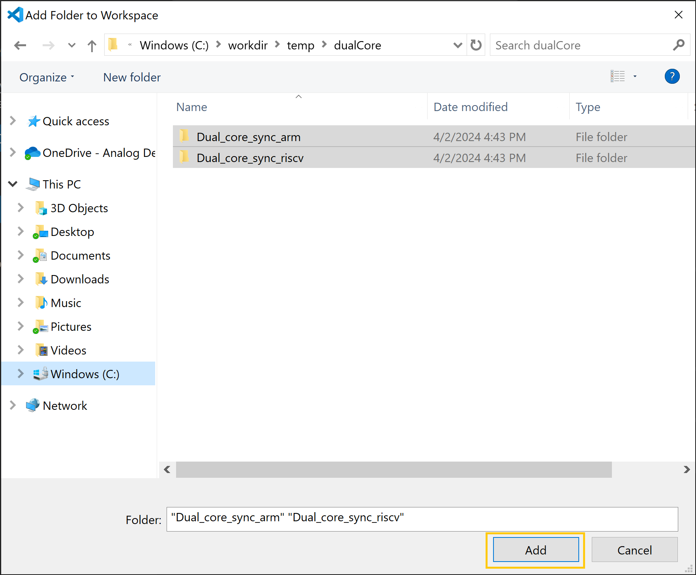

# Open and migrate example

The MSDK contains examples for each microcontroller that demonstrate the usage of peripheral APIs and other supported libraries. These examples are provided as reference.

## Duplicate the Example Folder

!!! warning
    We strongly recommend copying the example projects before modifying any files to preserve the original examples.

1. Open a file explorer.
2. Navigate to your installation directory > SDK > MAX
3. Copy the Examples folder to the desired location.
4. You can now open an example project in a [single folder workspace](#open-in-a-single-folder-workspace) or a [multi folder workspace](#open-in-a-multi-folder-workspace).

## Open in a single folder workspace

1. Launch an instance of VS Code.
2. Click on the Explorer icon in the VS Code activity bar.
3. Click the **Open Folder** button.  
  
  
4. Navigate to the location where you saved the example projects.
5. Select the example project to open, and click **Add**.

    !!! tip
        If you receive the notification **Do you trust the authors of the files in this folder?**, check the box labeled **Trust the authors** and click **Yes, I trust the authors**.

6. If the project needs to be migrated to a CodeFusion Studio Project, a notification prompt will appear asking you to migrate.
7. Confirm the project has been migrated by expanding the `.vscode` folder and verifying the backup folder containing MSDK settings is present.
 
 

## Open in a multi folder workspace

1. Launch an instance of VS Code.
2. Click on the Explorer icon in the VS Code activity bar.
3. Click the **Open Folder** button.  
  
  
4. Navigate to the location where you saved the examples.
5. Select two example projects to open, and click **Add**.

    !!! warning
        You must select two distinct projects, each containing a **makefile** at the highest level in their respective folder structure.

    

6. If the project needs to be migrated to a CodeFusion Studio Project, a notification prompt will appear asking you to migrate. Click **Migrate** to continue.

7. Confirm the project has been migrated by expanding the `.vscode` folder and verifying the backup folder containing MSDK settings is present.
 
 
