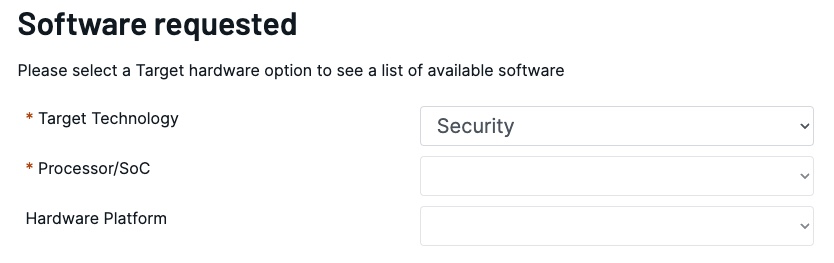

# Trusted Edge Security Architecture (TESA)

ADI’s security for the Intelligent Edge is seamlessly integrated into CodeFusion Studio through Trusted Edge.

Trusted Edge provides the foundational layer of security within the Trusted Edge Security Architecture (TESA), combining industry-standard cryptographic APIs with the hardware-based security capabilities of ADI platforms.

## Features

- **Flexibility** – Choose from multiple industry-standard crypto libraries that best fit your application.
- **Simplicity** – Access hardware security features across ADI’s complete digital portfolio.
- **Reduced time-to-market** – Reduce time-to-market with foundational security services that simplify implementation.

## Installation

### Complete the software request form

The TESA security package is distributed under a non-disclosure agreement (NDA) through myAnalog.

!!! note
    A **myAnalog** account is required. Login or sign up at [:octicons-link-external-24: analog.com](https://www.analog.com/en/index.html){:target="_blank"}

1. Access the [:octicons-link-external-24: Software Request Form](https://analog.com/srf){:target="_blank"}.
2. Log in or sign up for a myAnalog account.
3. Complete the required fields in the **Software Recipient Information** section.
4. Complete the required fields in the **Commercial information** section.
5. In the Software requested section, select **Security** for the target technology.

    !!! danger "Important"
        Leave **Processor/SoC** and **Hardware Platform** blank.

    

6. Check the box for your preferred operating system: Windows, macOS, or Linux.
7. Review the privacy settings and check the applicable boxes.
8. Click **Submit**.

You will receive a confirmation at the email address you provided in the software request form. Allow 10 business days for ADI to review your request. Once your NDA is approved, you will be granted access to the TESA package through the CodeFusion Studio Package Manager. This package provides the security toolchain and components required for developing trusted applications.

### Install the TESA package

After your NDA is approved, you can install the TESA package directly from the CodeFusion Studio [Package Manager](../installation/package-manager/index.md).

To install:

1. Configure partner access. Complete the setup steps provided with your NDA approval to enable access to restricted repositories.
2. Install the TESA package using one of the following methods:  
      - [Command Palette](../installation/package-manager/manage-packages-command-palette.md)  
      - [Command line (`cfsutil`)](../installation/package-manager/manage-packages-cfsutil.md)

!!! note
    The TESA package is only available to NDA-approved partners. For repository setup details, refer to your internal installation guide or contact your ADI representative.

## Security Foundation Layer

The Security Foundation Layer provides the core building blocks of TESA. It defines the middleware, frameworks, and tools that implement trusted execution, cryptographic operations, secure boot, and lifecycle management across supported ADI MCUs.

### TESA middleware

TESA middleware implements the foundational security stack for the Trusted Edge architecture, integrating cryptographic libraries, APIs, and MCU-level frameworks such as Trusted Firmware-M and MCUboot.

#### Cryptographic libraries and APIs

TESA supports multiple cryptographic backends and APIs, including:

- Crypto library options
    - mbedTLS
    - wolfSSL
    - PSA Crypto API

- ADI extensions
    - ADI USS API
    - Root of Trust Services

- Unified Security Software (USS)
    - Secure Storage
    - Crypto Toolbox
    - Secure Communication
    - Universal Crypto Library (UCL)

#### MCU framework integration

TESA integrates with multiple MCU-level security frameworks to deliver trusted boot, firmware validation, and lifecycle management.

##### Trusted Firmware-M (TF-M)

[:octicons-link-external-24: Trusted Firmware-M (TF-M)](https://www.trustedfirmware.org/projects/tf-m){:target="_blank"} is the platform security architecture reference implementation aligning with PSA Certified guidelines.

ADI’s implementation, delivered through TESA, provides out-of-the-box support for the open source TF-M build using mbedTLS, as well as a premium configuration that enhances security performance through Universal Crypto Library (UCL).

For a list of supported devices, see [:octicons-link-external-24: TF-M ADI platforms](https://trustedfirmware-m.readthedocs.io/en/latest/platform/adi/index.html){:target="_blank"}.

For information on setting up and using TF-M in CFS, see [Arm&reg; TrustZone&reg;](../workspaces/targets/trustzone.md).

##### MCUboot

MCUboot is included with TF-M to provide Level-2 bootloader functionality within the boot chain. TESA enhances MCUboot with UCL, enabling secure boot and improved cryptographic performance.

### Unified Security Software

USS extends standard PSA and ADI APIs through a backend that delivers:

- Secure Boot  
- Secure Channel  
- Lifecycle Management  
- Secure Storage  
- Cryptographic Toolbox  
- Attestation  

USS includes standalone MCU-only software security emulations for ADI devices.

The PSA Crypto implementation within USS is called the ADI Universal Crypto Library (UCL). UCL provides high-performance cryptographic algorithms for ADI MCUs, supporting hashing, encryption/decryption, signature verification, key exchange, and random number generation.  
It also includes countermeasures against side-channel attacks and leverages the hardware accelerator of the target ADI platform whenever applicable.

#### TESA Driver

USS provides rich, hardware-independent APIs for:

- Crypto  
- Life cycle management  
- Secure storage

### TESA Toolkit

The TESA toolkit includes utility scripts and firmware for:

- Generating signatures  
- Enabling Secure Boot ROM  

The TESA toolkit is available on GitHub at [:octicons-link-external-24: TESA-Toolkit](https://github.com/analogdevicesinc/tesa-toolkit){:target="_blank"}

### USS Supported boards

- **MAX32650**
    - [:octicons-link-external-24: EVKit V1](https://www.analog.com/en/resources/evaluation-hardware-and-software/evaluation-boards-kits/max32650-evkit.html){:target="_blank"}
    - [:octicons-link-external-24: FTHR](https://www.analog.com/en/resources/evaluation-hardware-and-software/evaluation-boards-kits/max32650fthr.html){:target="_blank"}
    - [:octicons-link-external-24: AD-SWIOT1L-SL](https://www.analog.com/en/resources/evaluation-hardware-and-software/evaluation-boards-kits/ad-swiot1l-sl.html){:target="_blank"}
- **MAX32657**
    - EVKit
- **MAX32670**
    - [:octicons-link-external-24: EVKit V1](https://www.analog.com/en/resources/evaluation-hardware-and-software/evaluation-boards-kits/max32670evkit.html){:target="_blank"}
- **MAX32690**
    - [:octicons-link-external-24: AD-APARD32690-SL](https://www.analog.com/en/resources/evaluation-hardware-and-software/evaluation-boards-kits/ad-apard32690-sl.html){:target="_blank"}
    - [:octicons-link-external-24: EVKit V1](https://www.analog.com/en/resources/evaluation-hardware-and-software/evaluation-boards-kits/max32690evkit.html){:target="_blank"}
    - [:octicons-link-external-24: FTHR](https://www.analog.com/en/resources/evaluation-hardware-and-software/evaluation-boards-kits/max32620fthr.html){:target="_blank"}
    - [:octicons-link-external-24: EVAL-ADIN1110](https://www.analog.com/en/resources/evaluation-hardware-and-software/evaluation-boards-kits/eval-adin1110.html){:target="_blank"}
    - [:octicons-link-external-24: MAXQ1065EVKIT](https://www.analog.com/en/resources/evaluation-hardware-and-software/evaluation-boards-kits/maxq1065evkit.html){:target="_blank"}
