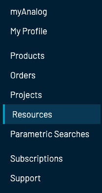
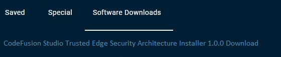
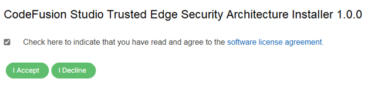

# Trusted Edge Security Architecture

ADI's security for the Intelligent Edge is seamlessly bundled into CodeFusion Studio with **Trusted Edge**.

The Trusted Edge provides the foundational layer of security for the customer by melding industry standard crpyto APIs with the security capabilities our hardware security solutions.

## Features

Flexibility - Choose the crypto library that best fits your application. The Trusted Edge supports industry standard crypto APIs.

Simplicity - Access hardware security capabilities of the complete ADI digital portfolio.

Reduced time-to-market - The Trusted Edge provides a secure foundation for your application, reducing the time needed to implement security.

## Installation

The security installer for CodeFusion Studio is distributed under a non-disclosure agreement (NDA) through myAnalog.

1. Access [analog.com](https://www.analog.com/en/index.html).

2. Log in or sign up for a **myAnalog** account.

    

3. After you log in, click **Your Account**.
4. Select **Resources** from the left navigation panel.

    

5. Select **Software Downloads**.
6. Click **CodeFusion Studio Trusted Edge Security Architecture Installer**.

    

7. Check the box to indicate that you have read and agree to the software license agreement and click **I Accept**.

    

8. Open the downloaded installer and follow the setup wizard to complete the installation.

## Security Foundation Layer

- Crypto library options
    - mbedTLS
    - wolfSSL
    - PSA Crypto API
- ADI USS API
- Root of Trust Services
- Unified Security Software
    - Secure Storage
    - Crypto Toolbox
    - Secure Communication
    - Universal Crypto Library
- Hardware Crypto Accelerators and Security Features

### Supported boards

USS Supports: MAX32690

- [APARD](https://www.analog.com/en/resources/evaluation-hardware-and-software/evaluation-boards-kits/ad-apard32690-sl.html)
- [MAX32690 EvKit](https://www.analog.com/en/resources/evaluation-hardware-and-software/evaluation-boards-kits/max32690evkit.html)
- [EVAL-ADIN1110](https://www.analog.com/en/resources/evaluation-hardware-and-software/evaluation-boards-kits/eval-adin1110.html)
- [MAXQ1065EVKIT](https://www.analog.com/en/resources/evaluation-hardware-and-software/evaluation-boards-kits/maxq1065evkit.html)

### Unified Security Software

ADI Unified Security Software (USS) offers an API backend that provides Secure Boot, Secure Channel, Lifecycle Management, Secure Storage, Cryptographic Toolbox, and Attestation. It contains standalone MCU only software security emulations for ADI MCUs.

### Universal Crypto Library

The ADI Universal Crypto Library (UCL) contains state-of-the-art implementation of the crypto algorithms on ADI MCUs. The UCL contains hashing, encryption/decryption, signature/verification, key exchange, and random number generation capabilities. It implements countermeasures against side-channel attacks and utilizes the hardware accelerator of the target ADI platform whenever applicable.
