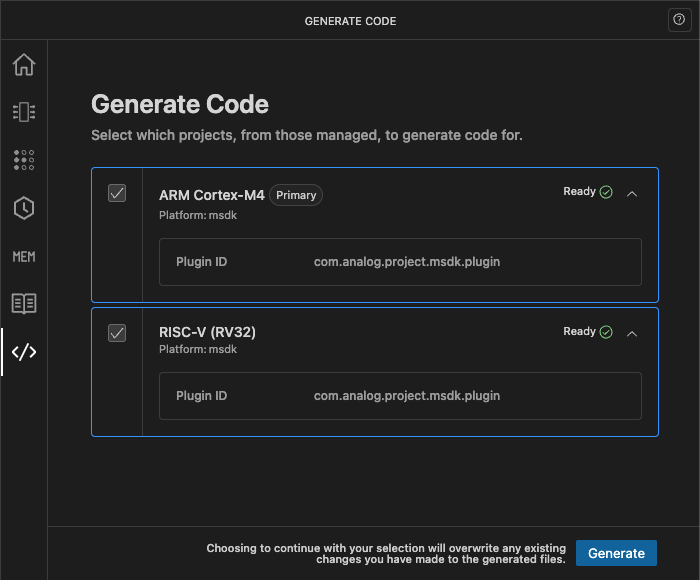
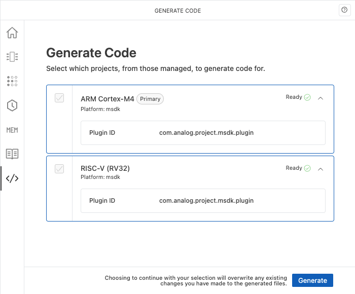

# Generate Code

The code generation feature allows you to generate configuration code for your project. This includes generating the necessary source files to configure memory allocation, peripheral settings, pin mappings, clock configurations, and other essential system settings.

{.only-dark}
{.only-light}

## Prerequisites

Before generating code:

- Ensure you have resolved any configuration errors, such as pin multiplexing conflicts or clock misconfigurations.
- Be aware that generated files will overwrite any existing versions. Back up any manually modified files if needed.

## Generating code files

1. Select the cores you want to generate code for.
1. Click **Generate**.
1. If you have unsaved changes, you will be prompted to save the CFS configuration file (`.cfsconfig`) before generating code.
1. The generated files are saved to your project or workspace according to the selected plugin's configuration.

## Working with generated code

The generated code files are added to your project automatically, and are detected and built without requiring configuration changes. You also do not need to invoke the generated functions manually, as the start-up code handles this for you.
