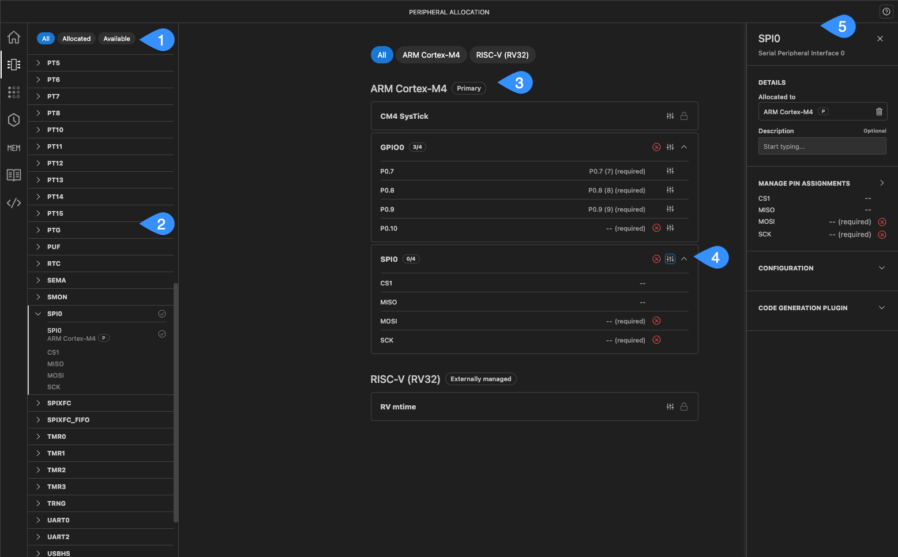
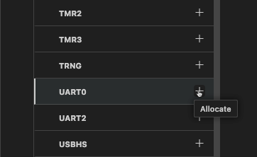
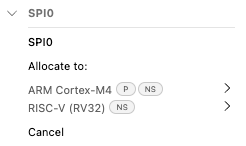
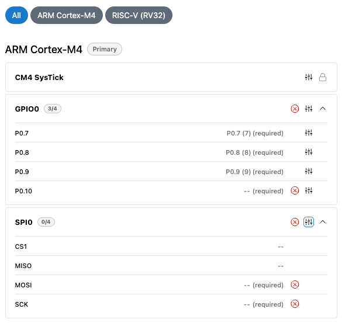
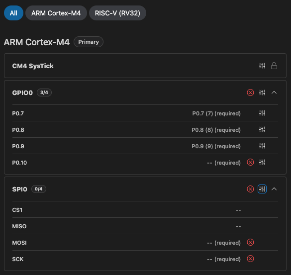
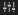
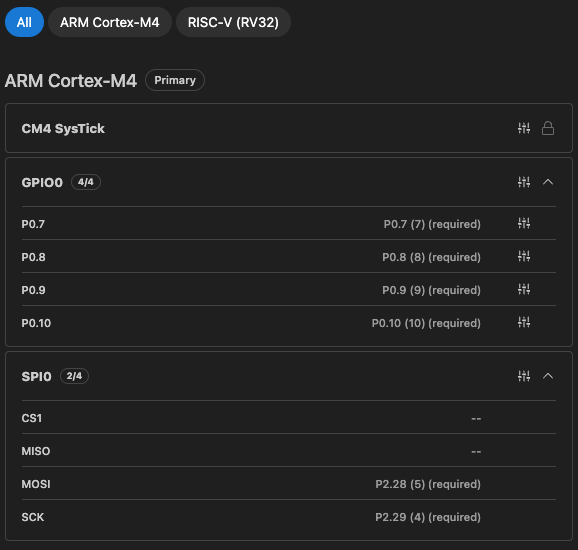
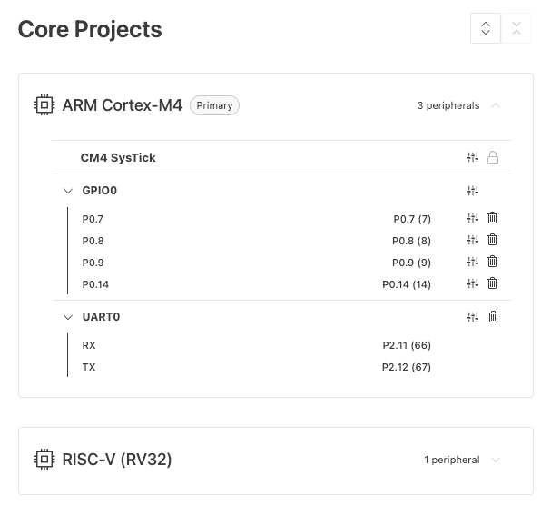

# Peripheral Allocation

The Peripheral Allocation feature allows you to assign SoC peripheral blocks to specific cores. This ensures efficient resource utilization, prevents conflicts, and enhances overall hardware performance.

## Peripheral Allocation overview

{.only-dark} {.only-light}

1. **Filter options**: Filter partitions by allocated or available memory.
1. **Peripheral list**: Displays available peripherals. Click to expand and view assignable blocks or signals.
1. **Assigned cores section**: Lists cores with their assigned peripherals, signals, or pins.
1. **Configure peripheral**: Click to open the peripheral settings sidebar for configuration.
1. **Peripheral settings sidebar**: Modify or delete pin assignments and configure peripheral parameters.

## Peripheral assignment types

There are two types of assignments:

- **Peripheral Block Assignment**: An entire peripheral block (such as UART0 or I2S2) is allocated to a single core. The core has full responsibility for initializing the peripheral, handling its interrupts, and managing its resources.
- **Signal Assignment**: Peripherals such as GPIO ports allow assignment at the signal level. The assigned core configures and manages interrupt handling for those signals.

## Allocating a peripheral block to a core

{.only-dark} {.only-light}

1. In the peripheral list, click a peripheral to expand it and view available blocks or pins.
2. Click the chevron (**>**) to see available cores.
3. Select a core from the list to complete allocation, or click **Cancel** to exit the process.

```{note}
- For GPIO peripherals, individual pins are assigned instead of the entire port.
```

### Limitations

- After a peripheral block is assigned to a core, it must be unassigned before it can be reassigned to another core. See [Unassigning a Peripheral](#unassigning-a-peripheral).
- Certain peripherals can only be assigned to specific cores due to hardware constraints.
- If a peripheral is shared across multiple cores (such as GPIO0), the primary core is responsible for system-wide initialization, including configuring clock sources and frequencies.

## Configuring a peripheral

Signals assigned to a core requiring pin assignment are labeled **required** and display a red X {.only-dark}
{.only-light}

{.only-light} {.only-dark}

To assign or modify pin assignments, complete the following steps:

1. Locate the target peripheral in the assigned cores section.
2. Click configure {.only-dark} {.only-light} to open the peripheral settings sidebar.
3. (Optional) Enter a **Description** to capture useful information about the peripheral.
4. In the **Manage Pin Assignments** section, click the chevron (**>**) to open the **Pin Config** tab.
5. Assign and adjust pins as needed.
6. Return to the **Peripheral Allocation** page to review peripheral parameters and assignments.

### Configuring parameters

The **Configuration** section in the peripheral settings sidebar allows you to set parameters for any assigned peripheral that supports configuration. Configuration field labels are dynamically generated from the **Control's Description** in the SoC’s data model. Some fields may appear or become mandatory based on the selected configuration options. If a required signal pin assignment is missing, a conflict icon will indicate that the assignment must be completed before proceeding with code generation.

Use the **Reset to Default** option to restore all settings to their default values.

### Code Generation plugin options

The **Code Generation Plugin** section allows you to pass additional configuration to the code generation plugin for the selected peripheral. The available options depend on the firmware platform.

Examples of plugin options for Zephyr include:

- **Chosen**: Specifies the intended role or function of the peripheral in your application, for example: `console`, `debug`, `modem`. Multiple values can be entered as a comma-separated list.

- **Frequency**: Defines the clock frequency to use during code generation for applicable peripherals.

Fields marked with an asterisk indicate that a non-default value has been selected.

## Unassigning a peripheral

To remove a peripheral assignment from a core:

1. Locate the target peripheral in the assigned cores section.
1. Click configure {.only-dark} {.only-light} to open the peripheral settings sidebar.
1. Click delete {.only-dark} {.only-light} to remove the peripheral assignment.

## Review peripheral assignment

Each peripheral entry includes the following:

- **Signals**: All signals managed by the peripheral. For example MISO and MOSI for SPI.
- **Assigned Pins**: The physical package pin where the signals are mapped. For example P2.11 (5) indicates GPIO pin P2.11 on package pin 5.
- **Allocation Status**: Each peripheral displays an allocation count to show how many signals have been assigned to pins out of the total available. For example, if SPIO displays (2/4), 2 out of 4 signals have been assigned to pins.

{.only-dark} {.only-light}
