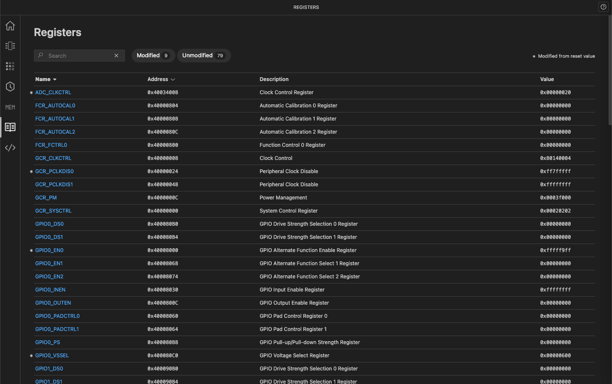
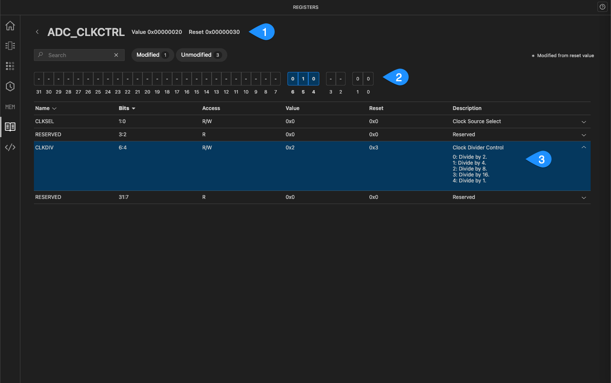
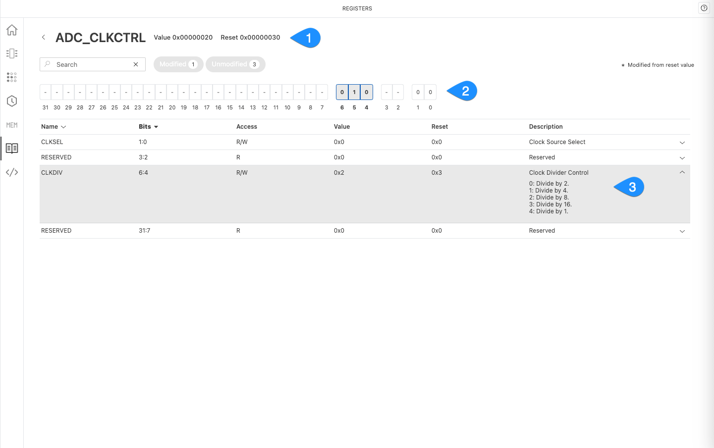

# Registers

The Registers feature displays registers used by the configuration code and their corresponding values. It also highlights registers that are modified due to changes in peripheral or signal configurations. Modified registers are marked with an asterisk (*).

## Search and filter registers

Use the **Search** field to locate registers by name or address. Use the preset filters to view registers with modified or unmodified values.

{.only-dark}
{.only-light}

## View register details

Click a register name to view its bit-level details, including individual bit values, access types, and descriptions.

1. **Hexadecimal values**: Displays the current and reset hexadecimal values.
1. **Binary values**: Shows the reset value in binary. Modified bits are highlighted with a distinct border.
1. **Field details**: Click a bit group or register field to view details such as access type (R/W), bit range, and description.

{.only-dark}
{.only-light}
