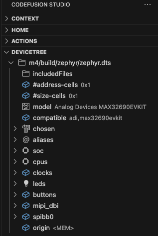
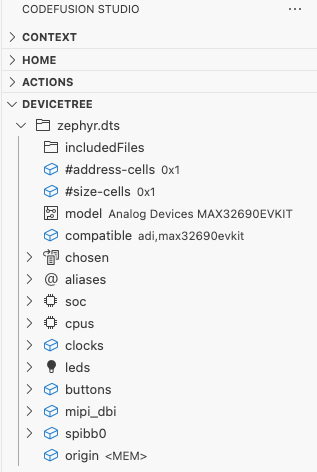

# Device Tree View

In Zephyr, a **device tree** (or **devicetree**) is a hierarchical data structure primarily used to describe the hardware available on supported boards, as well as their initial configurations.

Use the Device Tree View in CodeFusion Studio to review hardware components and your system's hardware configuration.

Access the Device Tree View using the following methods:

- Build a Zephyr project, then select the project in the **Context** menu. The Device Tree View automatically displays the project's `zephyr.dts` file.
- Open any Device Tree file (`*.dtsi` or `*.overlay`) in the VS Code window.

{.only-dark}
{.only-light}

## Additional information

The Device Tree View in CodeFusion Studio is based on the Zephyr devicetree specification. For more details, refer to the [Zephyr Devicetree documentation](https://docs.zephyrproject.org/latest/build/dts/index.html#devicetree-guide).

You can also use the `cfsutil` command line utility to parse device tree files from the terminal. For more details, refer to [CFS command line utility](cfsutil.md#device-tree).
