# ELF File Explorer

The ELF File Explorer enables users to quickly parse and analyze compiled binaries, reducing time spent on debugging and profiling and providing deeper insights into the application structure.

## Supported formats

The CodeFusion Studio ELF File Explorer can open and display the contents of any file with a valid ELF header.
The file extensions supported by the ELF File Explorer are: AXF, DOJ, DXE, ELF, EXE, KO, MOD, O, OUT, PRX, PUFF, and SO.

## Open a file

### Open from Activity bar

1. Select the CodeFusion Studio icon from the activity bar.
2. Select **Open ELF File** under **ELF File Explorer**.
3. Navigate to the ELF file you want to open.

### Open from Explorer

Click on any ELF file in the explorer to view the contents of that file.

## Navigation

Navigation icons are on the left of the page for: Statistics, Metadata, Symbols and Memory Layout.
Help is available via the help icon in the top right corner.

## Statistics

The statistics page provides high level information about the ELF file and it's contents. Information is displayed in five sections.

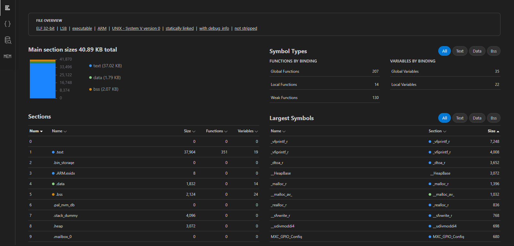{.only-dark}
{.only-light}

### File overview

The file overview is a summary of the metadata for the ELF file:

- **Format:** ELF 32-bit or 64-bit.
- **Data Encoding:** Indicates the endianness (little or big endian).
- **File Type:** Executable, relocatable, shared object, or core file.
- **Architecture:** Target architecture (for example Arm, x86).
- **ABI Version:** Application Binary Interface version.
- **Debug Info:** Indicates if the file contains debugging information.
- **Stripping:** Indicates if the file has been stripped of symbol information.

### Main section sizes

The main section sizes shows the total memory used in the ELF, with a breakdown of the main data types.

- **Text:** Executable code.
- **Data:** Initialized global and static variables.
- **Bss:** Zero-initialized data, both explicitly zero and uninitialized data.

### Symbol types

Symbol types shows a count of functions and variables by binding: **global**, **local**, and **weak**.
Filters are provided above the table for **all**, **text**, **data** and **bss**.

### Sections

The Sections table provides details on all the sections contained within the ELF.

### Largest symbols

The Largest symbols table provides details on the 10 largest symbols in the ELF.
Filters are provided above the table for **all**, **text**, **data** and **bss**.

## Metadata

The metadata page displays a summary of the sizes of each data type used (**text**, **data** and **bss**), and all the information contained within the ELF header.
This includes information about the architecture, data layout, ELF version, contents, and flags.

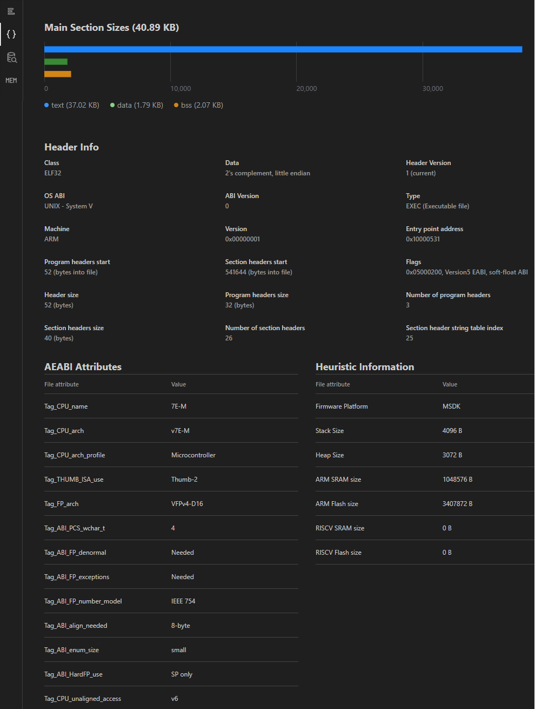{.only-dark}
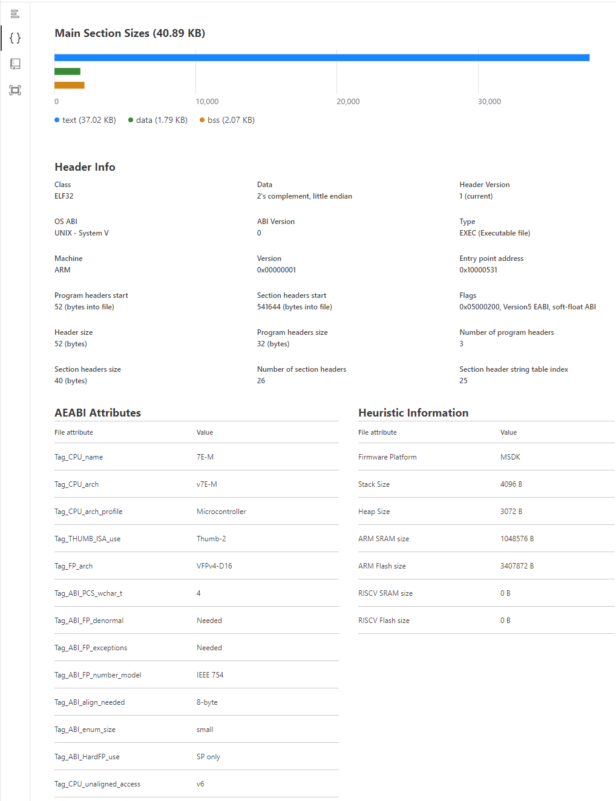{.only-light}

### Header Info

The ELF file header contains metadata about the ELF file, including its type, architecture, entry point, program headers, and section headers.
This information is essential for the operating system to correctly load and execute the file.

### AEABI Attributes

The AEABI (Arm Embedded Application Binary Interface) attributes in an ELF file provide important metadata about the binary, such as the target architecture, floating-point configuration, and optimization level.
These attributes ensure compatibility and optimize performance by conveying specific details about how the binary was built, allowing tools and runtime environments to correctly interpret and execute the code.

### Heuristic Information

Indicates the presence of any heuristic information detected in the ELF file related to the Zephyr and MSDK firmware platforms.
It can provide information regarding Flash and RAM sizes, among other available data.

## Symbols Explorer

The Symbol explorer provides a table of all the symbols within the ELF file. This table can be sorted by clicking the title of any column and can be filtered using an SQL query allowing you to access the data in any way you require.

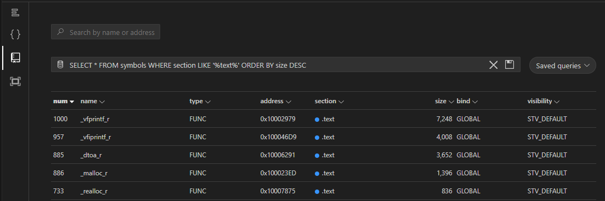{.only-dark}
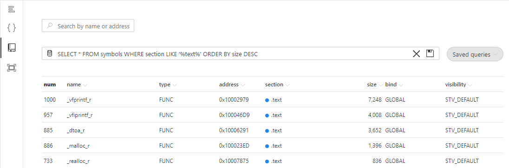{.only-light}

The default view `SELECT *` includes the following fields. You can change which fields are shown and in what order by replacing the `*` with a list of field names separated by a comma. For example `SELECT size,name` will show the size column followed by name.

| Column     | Type    | Description                                                                                    |
| ---------- | ------- | ---------------------------------------------------------------------------------------------- |
| id         | integer | The unique identifier for the symbol                                                      |
| name       | string  | The name of the symbol                                                                        |
| type       | string  | The type of the symbol, indicating what kind of entity it represents                          |
| address    | integer | The memory address where the symbol is located                                                |
| section    | string  | The section of the program in which the symbol is defined                                     |
| size       | integer | The size of the symbol in bytes                                                               |
| localstack | integer | The worst stack usage size for a function (only local stack, not considering functions called)|
| stack      | integer | The worst stack usage size for a function (considering functions called)                      |
| bind       | string  | The linkage type of the symbol (e.g., local, global)                                          |
| visibility | string  | The visibility of the symbol, indicating its accessibility from other modules (e.g., default, hidden) |
| path       | string  | The source file location where the symbol is defined                                           |

```{note}
The localstack, stack and path columns are only present when the relevant data is present in the ELF.
For localstack and stack, the following GCC switches are required during build:
`-fdump-rtl-expand -fstack-usage -fdump-rtl-dfinish -fdump-ipa-cgraph -gdwarf-4`.
These switches are defined by default with CodeFusion Studio projects.
```

### Generating additional compiler data

To generate SU and CGRAPH files with GCC (required for worst-case stack usage calculations, and call graph navigation), compile your code with the following flags: `-fstack-usage -fdump-ipa-cgraph -gdwarf-4`.

These flags will force the compiler to generate debug information using the DWARF-4 standard, which is the version currently supported by the built-in DWARF parser.

#### Zephyr

For Zephyr projects, add the following flags to CMakeLists.txt:

```kconfig
zephyr_cc_option(-fstack-usage)
zephyr_cc_option(-fdump-ipa-cgraph)
zephyr_cc_option(-gdwarf-4)
```

#### MSDK

For MSDK projects, add the following flags to the Makefile:

```kconfig
PROJ_CFLAGS += -fstack-usage
PROJ_CFLAGS += -fdump-ipa-cgraph
PROJ_CFLAGS += -gdwarf-4
```

```{note}
Stack usage and call graph data can only be parsed when generated by GCC.
```

### Filters

The table can be filtered using SQL commands, where the table is named **symbols** and the fields are as above.

```{tip}
A quick lookup field is present above the table to search by name or address. Enter a text or numerical value and press **Enter** to generate a query.
```

### Queries

Queries can be saved using the save icon to the right of the query field.
Click on the **Saved queries** button to the right of the query field to see a list of saved queries including some pre-populated queries. Queries can be edited or deleted from here by clicking on the pencil or trash can icon.

```{note}
Saved queries are stored in the user settings so they are available on any workspace.
```

Any valid SQL construct is supported here, including `WHERE`, `ORDER`, `LIMIT`, `LIKE` and `REGEXP`.
Some examples of queries are as follows.

| Filter                        | Query                                                                   |
| ----------------------------- | ----------------------------------------------------------------------- |
| Specific columns              | `SELECT name,address FROM symbols`                                      |
| Symbols larger than 100 bytes | `SELECT * FROM symbols WHERE size > 100`                                |
| Largest symbols               | `SELECT * FROM symbols ORDER BY size DESC LIMIT 10`                     |
| Symbols between addresses     | `SELECT * from symbols WHERE address BETWEEN 0x10000000 AND 0x20000000` |
| Symbols from a specific file  | `SELECT * from symbols WHERE path LIKE %main.c%`                        |
| Symbols starting with string  | `SELECT * FROM symbols WHERE name REGEXP '^init\*'`                     |

## Memory Layout

The Memory Layout page provides a visual representation of the memory map on the left, with a table of memory segments on the right.
The memory map is shared to denote the usage of the memory:

- Stripes: Unused memory.
- Blank: Read/write memory.
- Filled: Read only memory.

```{note}
Overlapping segments are rendered as smaller rectangles to the right of the main segments.
Small segments may be displayed taller than their actual relative size to enhance readability. Refer to the size value for an accurate size value.
```

Hovering over a segment in the memory map provides a summary of the memory segment and highlights the appropriate table entry.

Hovering over a segment in the table highlights the appropriate entry in the memory map.

### Segments

The Segments table shows a high-level summary of each distinct segment of memory.
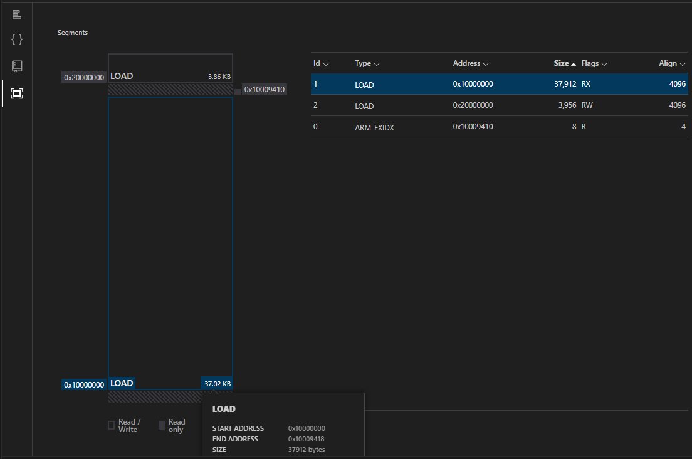{.only-dark}
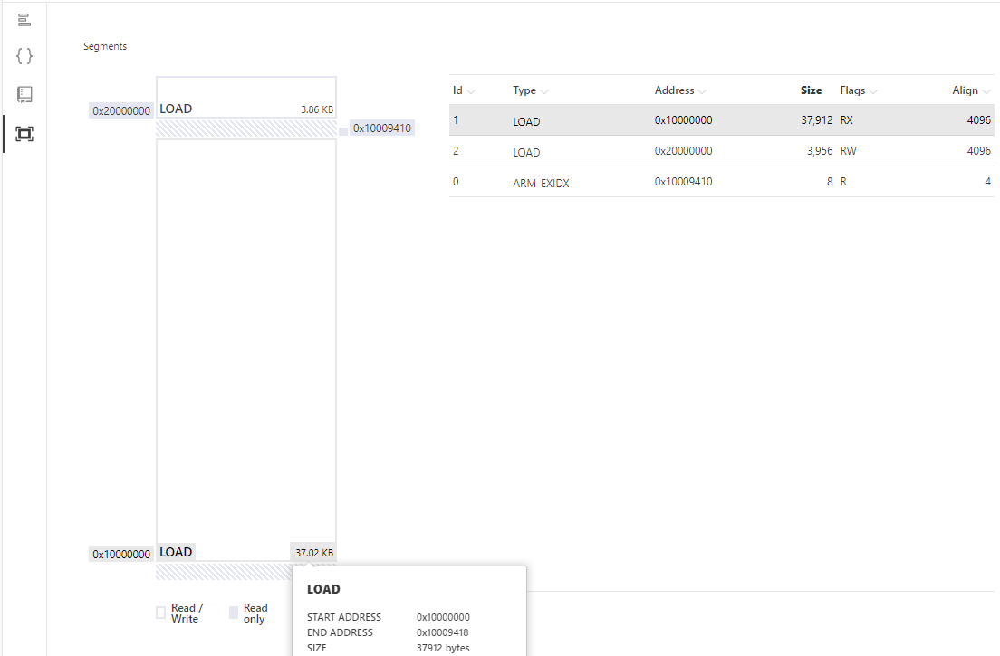{.only-light}

The table includes the following fields:

| Field   | Description                                                                   |
| ------- | ----------------------------------------------------------------------------- |
| Id      | The unique identifier for the segment                                         |
| Type    | The type of the segment, indicating its purpose (e.g., loadable, dynamic)     |
| Address | The memory address where the segment begins                                   |
| Size    | The size of the segment in bytes                                              |
| Flags   | Permissions and attributes for the segment (R: read, W: write, X: executable) |
| Align   | The alignment requirement of the segment in memory in bytes                   |

Clicking on a segment will show you a table with the sections in that segment.

### Sections in a Segment

The Sections in a segment table shows a high-level summary of all the sections in that memory segment.
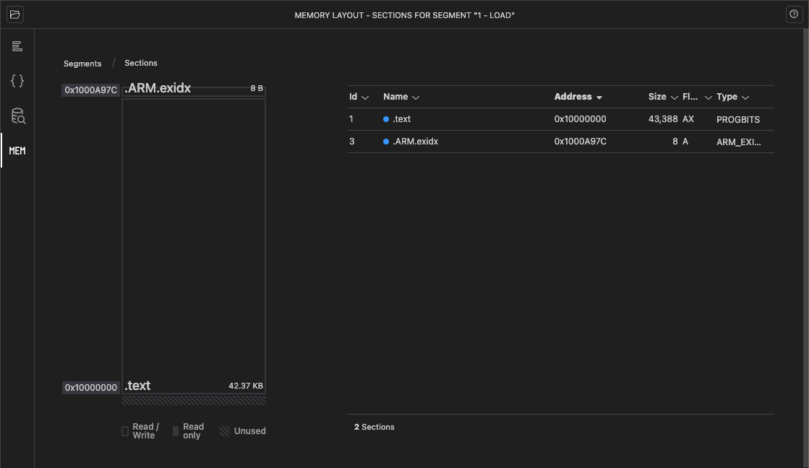{.only-dark}
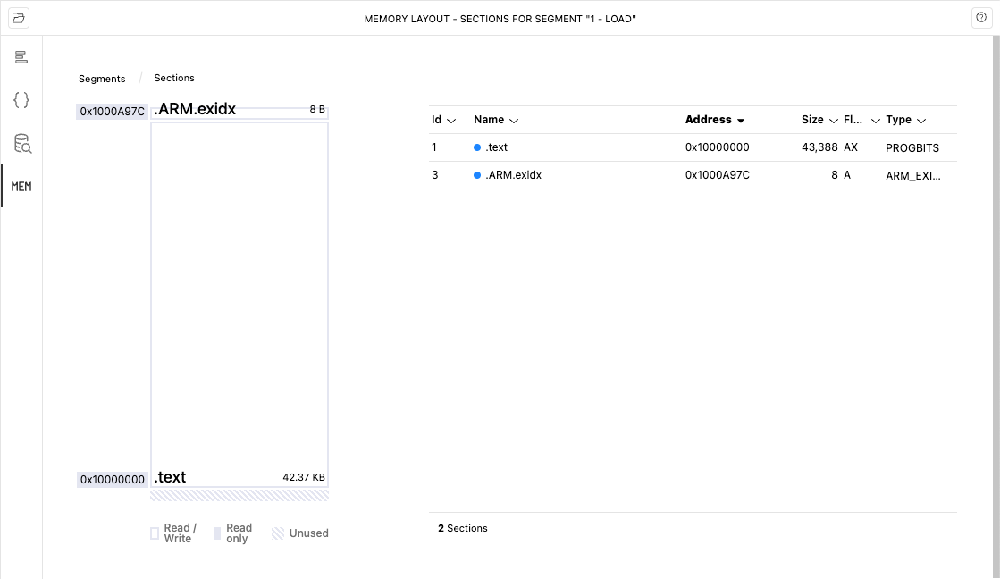{.only-light}

The Sections in a Segment table includes the following fields:

| Field   | Description                                                                    |
| ------- | ------------------------------------------------------------------------------ |
| Id      |  The unique identifier for the section                                         |
| Name    |  The name of the section                                                       |
| Address |  The memory address where the section begins                                   |
| Size    |  The size of the section in bytes                                              |
| Flags   |  Permissions and attributes for the section described in the flags table       |
| Type    |  The type of the section, indicating its contents and purpose                  |

| Flag | Description                  |
| ---- | ---------------------------- |
| W    | write                        |
| A    | alloc                        |
| X    | execute                      |
| M    | merge                        |
| S    | strings                      |
| I    | info                         |
| L    | link order                   |
| O    | extra OS processing required |
| G    | group                        |
| T    | TLS                          |
| C    | compressed                   |
| x    | unknown                      |
| o    | OS specific                  |
| E    | exclude                      |
| D    | mbind                        |
| y    | purecode                     |
| p    | processor specific           |

Clicking on a section will show you a table containing the symbols in that section.
To return to the Segments, click on the **Segments** link in the breadcrumb at the top left of the page.

### Symbols in a Section

The Symbols in a section table shows details for the symbols within that section.
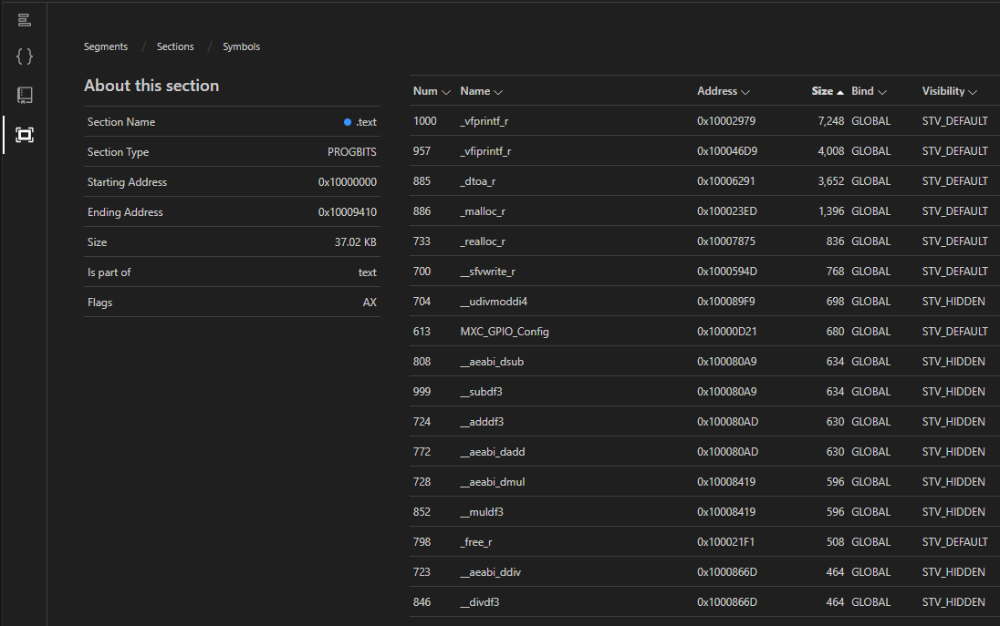{.only-dark}
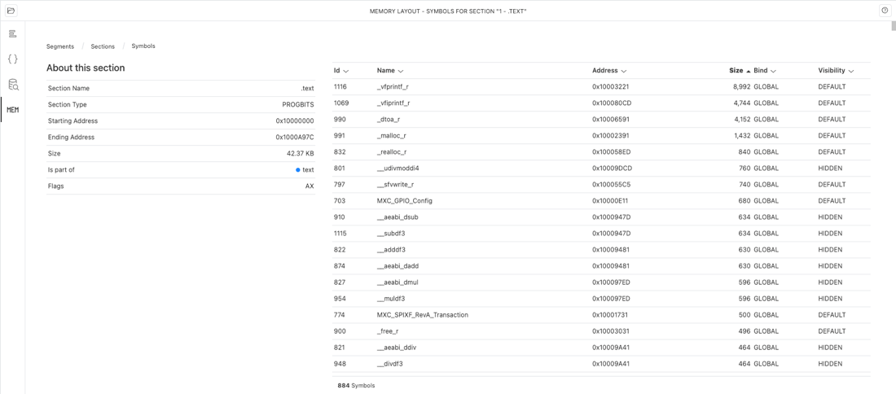{.only-light}

The Symbols in a section table includes the following fields:

| Field      | Description                                                                   |
| ---------- | ----------------------------------------------------------------------------- |
| Id         |  The unique identifier for the symbol                                         |
| Name       |  The name of the symbol                                                       |
| Address    |  The memory address where the symbol is located                               |
| Size       |  The size of the symbol in bytes                                              |
| Bind       |  The linkage type of the symbol (for example: local, global)                  |
| Visibility |  The visibility of the symbol, indicating its accessibility from other modules (for example: default, hidden) |

To return to the Sections Segments, click on the appropriate link in the breadcrumb at the top left of the page.
