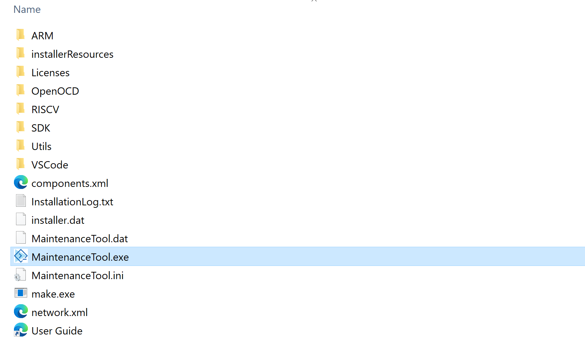

# Uninstall CodeFusion Studio

## Uninstall the extension from VS Code

1. Select the **Extensions** icon from the activity bar.
2. Find the **CodeFusion Studio** extension in the **INSTALLED** list.
3. Click on the **Manage** (cog) icon on the right hand side.
4. Select **Uninstall**.

!!! note
    Keyboard shortcut to extensions is **Control** + **SHIFT** + **X** (Windows/Linux) or **Command** + **SHIFT** + **X** (Mac).

## Uninstall from file system on Windows

1. Navigate to the directory where **CodeFusion Studio** is installed.
2. Locate the **MaintenanceTool.exe** application and double click on it.
3. After the **MaintenanceTool.exe** application launches, select **Remove all components** from the setup menu.
4. Click **Next** to continue.
5. Confirm that the correct directory is being removed and click **Uninstall**.
6. CodeFusion Studio will now be uninstalled.
7. After the uninstallation completes, you may close the installer by clicking **Finish**.

## Remove the file system on Linux or Mac

The CodeFusion Studio directory can be deleted directly from the filesystem without needing to run an uninstall utility.
