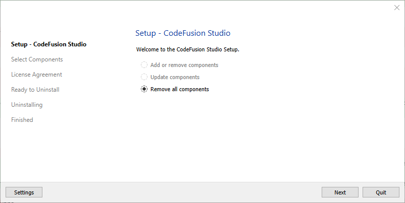
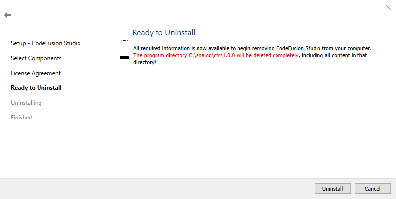
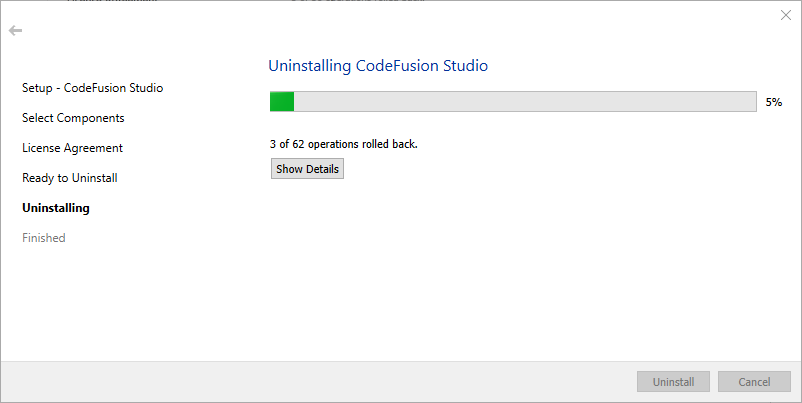

# Uninstall CodeFusion Studio

## Uninstall the extension from VS Code

1. Select the **Extensions** icon from the activity bar.
2. Find the **CodeFusion Studio** extension in the **INSTALLED** list.
3. Click on the **Manage** (cog) icon on the right hand side.
4. Select **Uninstall**.

!!! note
    Keyboard shortcut to extensions is **Control** + **SHIFT** + **X** (Windows/Linux) or **Command** + **SHIFT** + **X** (Mac).

## Uninstall from file system

You can uninstall CodeFusion Studio using the Maintenance Tool.

1. Navigate to the directory where **CodeFusion Studio** is installed.
    - The Windows default location is `C:\analog\cfs\`
    - The macOS or Linux default location is `~/analog/cfs/`
2. Open the folder for the version you want to uninstall.
3. Launch the Maintenance Tool:
    - On Windows, double click **MaintenanceTool.exe**
    - On macOS, double click **MaintenanceTool.app**
    - On Ubuntu, double click **MaintenanceTool**
4. Select **Remove all components** and follow the prompt to continue
5. Check that the correct directory is being removed and click **Uninstall**.
6. CodeFusion Studio will now be uninstalled.
7. When the process completes, close the uninstaller 

## Uninstall packages

For CFS 2.0.0, SDKs, plugins, and data models are installed using the [Package Manager](../installation/package-manager/index.md). These packages are stored locally and are not removed when you uninstall CFS 2.0.0.

To fully reset your environment and remove cached packages, delete the following directory:

- **Linux:** `/home/<username>/.local/share/com.analog.cfs`
- **macOS:** `/Users/<username>/Library/Preferences/com.analog.cfs`
- **Windows:** `C:\Users\<username>\AppData\Local\com.analog.cfs`  

## Command line uninstall

Use the following command to uninstall CodeFusion Studio from the default location:

- Windows: `C:\analog\cfs\2.0.0\MaintenanceTool.exe purge`
- Linux: `~/analog/cfs/2.0.0/MaintenanceTool purge`
- macOS: `~/analog/cfs/2.0.0/MaintenanceTool.app/Contents/MacOS/MaintenanceTool purge`
