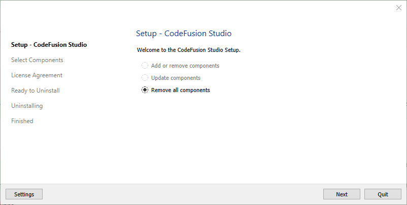
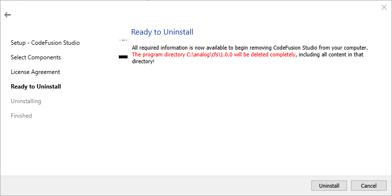
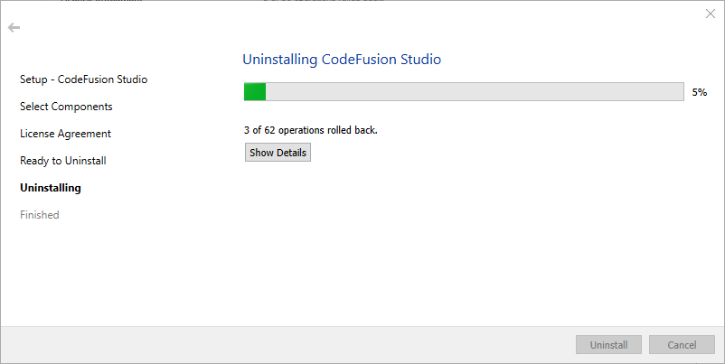
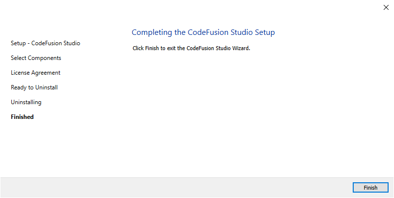

# Uninstall CodeFusion Studio

## Uninstall the extension from VS Code

1. Select the **Extensions** icon from the activity bar.

    !!! note
        You can also open Extensions using the keyboard shortcut **Ctrl + Shift + X** (Windows/Linux) or **Cmd + Shift + X** (macOS).

2. Find the **CodeFusion Studio** extension in the **INSTALLED** list.
3. Click on the **Manage** (cog) icon on the right hand side.
4. Select **Uninstall**.
5. Restart VS Code for the changes to take effect. Alternatively, reload the VS Code window by opening the Command Palette (`Ctrl+Shift+P` / `Cmd+Shift+P`) and running **Developer: Reload Window**.

!!! warning
    Uninstalling CodeFusion Studio does not remove its dependent extensions. These extensions (including Microsoft C/C++, Cortex-Debug, and Zephelin Trace Viewer) will remain installed in VS Code. If you no longer need them, uninstall each one separately using the same uninstall process. To view the complete list of dependent extensions, open the **Dependencies** tab in the CodeFusion Studio extension details before uninstalling.

## Uninstall from file system

You can uninstall CodeFusion Studio using the Maintenance Tool.

1. Navigate to the directory where **CodeFusion Studio** is installed.
    - The Windows default location is `C:\analog\cfs\`
    - The macOS or Linux default location is `~/analog/cfs/`
2. Open the folder for the version you want to uninstall.
3. Launch the Maintenance Tool:
    - On Windows, double click **MaintenanceTool.exe**
    - On macOS, double click **MaintenanceTool.app**
    - On Ubuntu, double click **MaintenanceTool**
4. Select **Remove all components** and follow the prompt to continue
5. Check that the correct directory is being removed and click **Uninstall**.
6. CodeFusion Studio will now be uninstalled.
7. When the process completes, close the uninstaller 

## Uninstall packages

From CFS 2.0.0 and later, SDKs, plugins, and data models are installed using the [Package Manager](../installation/package-manager/index.md). These packages are stored locally and are not removed when you uninstall CFS.

To fully reset your environment and remove cached packages, delete the following directory:

- **Linux:** `/home/<username>/.local/share/com.analog.cfs`
- **macOS:** `/Users/<username>/Library/Preferences/com.analog.cfs`
- **Windows:** `C:\Users\<username>\AppData\Local\com.analog.cfs`  

## Command line uninstall

Use the following command to uninstall CodeFusion Studio from the default location:

- Windows: `C:\analog\cfs\2.2.1\MaintenanceTool.exe purge`
- Linux: `~/analog/cfs/2.2.1/MaintenanceTool purge`
- macOS: `~/analog/cfs/2.2.1/MaintenanceTool.app/Contents/MacOS/MaintenanceTool purge`
