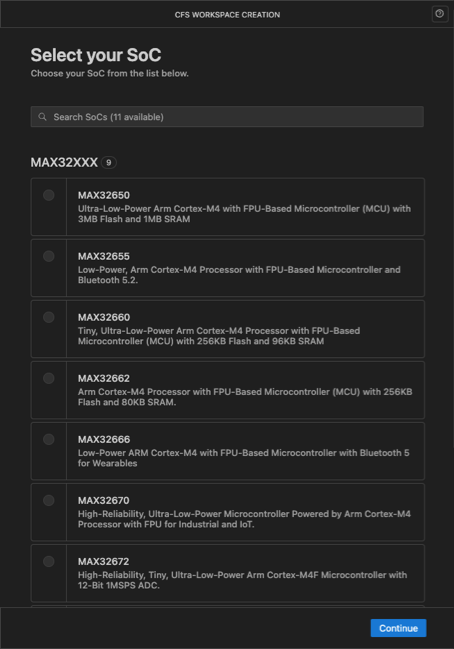
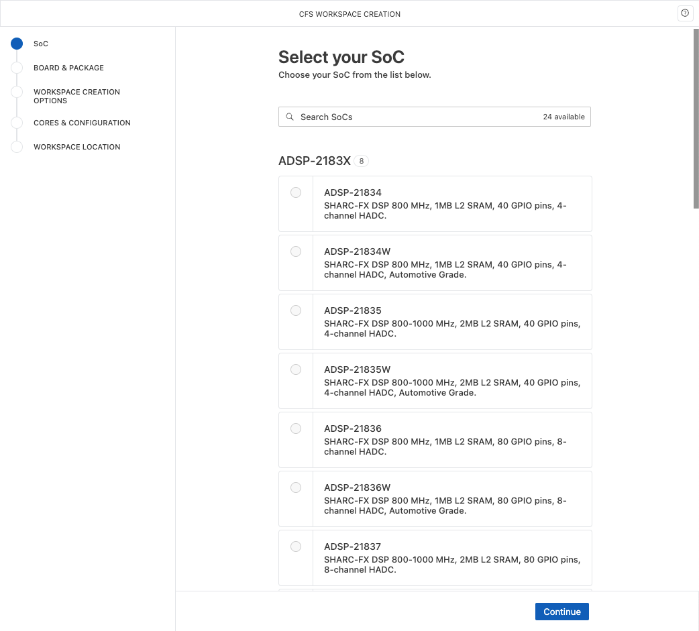

# Catalog Manager

The Catalog Manager is a background service in CodeFusion Studio that retrieves and maintains the SoC catalog. This catalog provides the latest metadata for supported System-on-Chip (SoC) devices, ensuring access to up-to-date information on documentation, cores, boards, and packages.

{.only-dark}
{.only-light}

## Settings

During installation, a backup copy of the catalog is stored in the `<install_dir>/Data/Soc/catalog.zip` directory.

The working copy of the catalog manager is stored at: `<${userHome}>/cfs/<cfs_version_number>/.catalog`.

The Catalog Manager regularly checks for updates to the SoC catalog. If using **Offline Mode**, the most recently cached catalog data is used.

## CFS Settings

```{note}
For details on accessing CFS settings, see [CFS Settings](./cfs-settings.md).
```

The Catalog Manager has the following user and workspace CFS settings:

- **Offline Mode** (`cfs.catalogManager.checkForUpdates`) – Use to work with a local cached catalog if an internet connection is unavailable.
- **Catalog Location** (`cfs.catalogManager.catalogLocation`) – Specifies the directory where the working copy of the catalog manager is stored. This location contains temporary files that store processed SoC data.
- **Catalog URL** (`cfs.catalogManager.url`) – Specifies the cloud service used to fetch updates.

## **Troubleshooting**

Refer to the following table for Catalog Manager errors and their resolutions.

| **Error Message**                                                  | **Possible Cause**                                      | **Resolution**                                                                                           |
| ------------------------------------------------------------------ | ------------------------------------------------------- | -------------------------------------------------------------------------------------------------------- |
| Catalog Manager failed to initialize with error: [error message] | There is an issue with the catalog zip, or the CFS settings need to be reviewed. | Verify that `<install_dir>/Data/Soc/catalog.zip` exists. Check if any `cfs.catalogManager` settings have changed, including `catalogLocation` and `url`. If needed, restore correct settings and restart CodeFusion Studio. |
| Failed to get catalog: [error details]                           | The Catalog Manager was unable to fetch the catalog from the cloud. | Check your internet connection. If the cloud service is unavailable, enable **Offline Mode**.  If needed delete the `.catalog` folder and restart CodeFusion Studio. |
