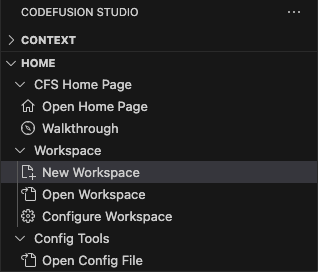
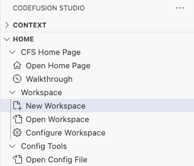
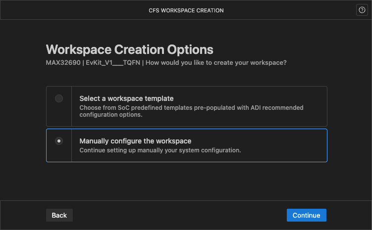
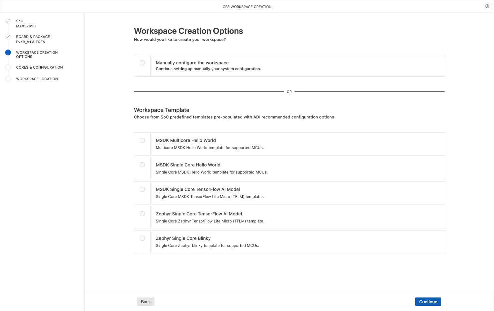
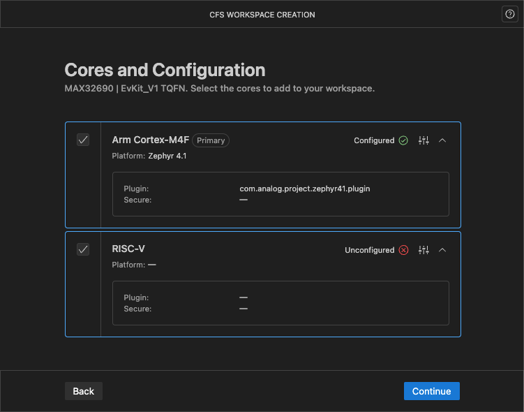
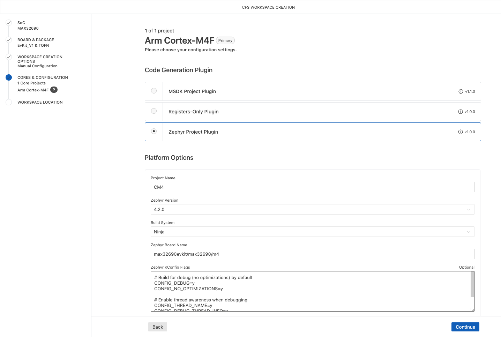

# Create a new workspace

New workspaces are created with the Workspace Creation Wizard.

## Launch the Workspace Creation Wizard

1. Click the CodeFusion Studio icon {.only-dark} {.only-light} in the VS Code activity bar.
1. Click **New Workspace**.

    {.only-dark}
    {.only-light}

## Create a workspace

1. Choose a processor from the list. You can type a partial name to filter the options.
1. Choose a board and package. For an ADI board, select the desired board under **Standard Boards and Packages**. For a custom board, select it under **Custom Board Packages**.
1. **Select a workspace template** or choose to **Manually configure the workspace**

    {.only-dark}
    {.only-light}

### Manually configure the workspace

Choose this option to set up your system configuration step by step.

1. Select the cores to include in your workspace. Start by selecting your primary core (mandatory).
1. Click **Config Options** {.only-dark} {.only-light} next to the core name.
1. Select a **Code Generation Plugin**. Each plugin provides configuration options for project generation.

   ```{note}
   The Registers-only (bare-metal) plugin is intended as a reference for advanced workflows. It enables code generation for platforms that do not use Zephyr or MSDK. The generated code references registers directly using MMR access. Build or debug support is not included as the generated register definitions are intended to be integrated into custom toolchains or external workflows.
   ```

1. For the **Project Name**, it is important to use a unique name for each core to avoid issues during project generation. For example, use the core ID, such as `CM4` or `RV`, to clearly distinguish projects associated with different cores.
1. For the **Board Name**, we recommend the following formats:

    - **Zephyr**:
        Use the format `<platform>/<soc>/<core>`, as defined by the `identifier` in your Zephyr board's yaml file. For example, the board name for the MAX32690 FTHR board can be found in `<CFS-Install>/SDK/zephyr/zephyr/boards/adi/max32690fthr/max32690fthr_max32690_m4.yaml`:
          ```
          identifier: max32690fthr/max32690/m4
          ```
          In this case, the Zephyr Board Name should be set to `max32690fthr/max32690/m4`.

    - **MSDK**:
        Use board names such as:
        - `EvKit_V1`
        - `APARD`
        - `FTHR`

1. Click **Apply** to save your configuration.
1. Repeat the steps above for other cores as required.

    {.only-dark}
    {.only-light}

### Select a workspace template

Choose a pre-defined SoC template with ADI-recommended configuration options. Type or filter to select a firmware platform, such as MSDK or Zephyr. You can choose from single or multi-core options.

### Complete workspace setup

1. Enter the workspace name (use letters, numbers, underscores, dashes, and periods only. No spaces or other special characters are permitted).
1. Use the default location or uncheck the box to choose a different location.

   ```{note}
   The workspace location can be edited manually or a new workspace location can be set using the **Browse** button.
   ```

1. Click **Create Workspace**.
1. If you receive the notification **Do you trust the authors of the files in this workspace?**, click **Yes, I trust the authors** to continue.
1. Once created, the workspace files will appear in the File Explorer, and the System Planner Configuration Tools dashboard will open. For information on using the dashboard, see [System Planner Configuration Tools](../tools/config-tool/index.md).
1. If generation fails, error messages will guide you to resolve issues before trying again.

### Copy workspace settings

You can create new workspaces based on the settings of an existing workspace by clicking **Configure Workspace** in the CodeFusion Studio interface. This opens the workspace creation wizard, pre-filled using the settings stored in your selected `.cfsworkspace` file. You can then modify options such as processor selection, board configuration, core settings, and firmware platform.

For example, if you initially created a workspace for the MAX32690 EV kit using an MSDK template, you could use **Configure Workspace** to start from that setup but switch to a Zephyr template without starting from scratch.
