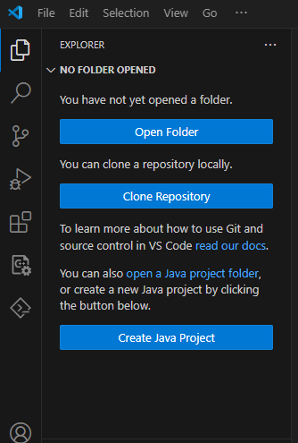
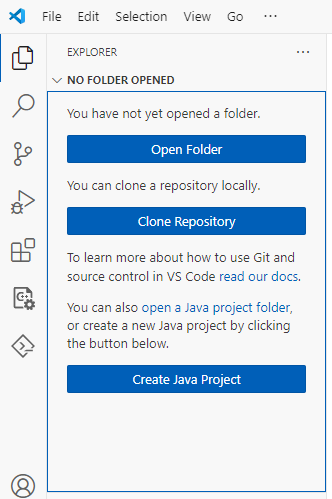

# Open and migrate example

The MSDK contains examples for each microcontroller that demonstrate the usage of peripheral APIs and other supported libraries. These examples are provided as reference.

```{note}
If you are moving a project to System Planner, follow the steps to [migrate a project to System Planner](../workspaces/migrate-project-to-system-planner.md)
```

## Duplicate the example folder

```{warning}
We strongly recommend copying the example projects before modifying any files to preserve the original examples.
```

1. Open **File Explorer**.
2. Navigate to your installation directory: **SDK>MAX>Examples**
3. Copy the **Examples** folder to the desired location.
4. You can now open an example project in a [single folder workspace](#open-in-a-single-folder-workspace) or a [multi folder workspace](#open-in-a-multi-folder-workspace).

## Open in a single folder workspace

1. Launch an instance of VS Code.
2. Click on the **Explorer** icon in the VS Code activity bar.
3. Click **Open Folder**.

   {.only-dark}
   {.only-light}

   ```{tip}
   Alternatively, click **File > Open Folder** from the top menu.
   ```

4. Navigate to the location where you saved the example projects.
5. Select the example project to open.
6. If you receive the notification **Do you trust the authors of the files in this workspace?**, click **Yes, I trust the authors** to continue.
7. If your existing project has not been configured as a CodeFusion Studio workspace, wait for the **Configuring** dialog box to complete before proceeding.
8. Confirm the project is ready by expanding the `.vscode` folder and verifying that the `settings.json` file contains the correct project settings.

   {.only-dark}
   {.only-light}

## Open in a multi folder workspace

1. Launch an instance of VS Code.
2. Click on the **Explorer** icon in the VS Code activity bar.
3. Click **Open Folder**.

   {.only-dark}
   {.only-light}

   ```{tip}
   Alternatively, click **File > Open Folder** from the top menu.
   ```

4. Navigate to the location where you saved the examples.
5. Select two example projects to open.
6. If you receive the notification **Do you trust the authors of the files in this workspace?**, click **Yes, I trust the authors** to continue.

   ```{warning}
   You must select two distinct projects, each containing a **makefile** at the highest level in their respective folder structure.
   ```
   {width=500px}

7. If your existing project has not been configured as a CodeFusion Studio workspace, wait for the **Configuring** dialog box to complete before proceeding.
8. Confirm the project is ready by expanding the `.vscode` folder and verifying that the `settings.json` file contains the correct project settings.

   {.only-dark}
   {.only-light}
