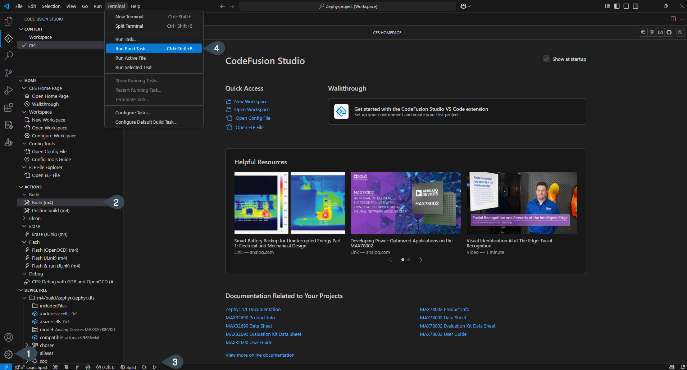
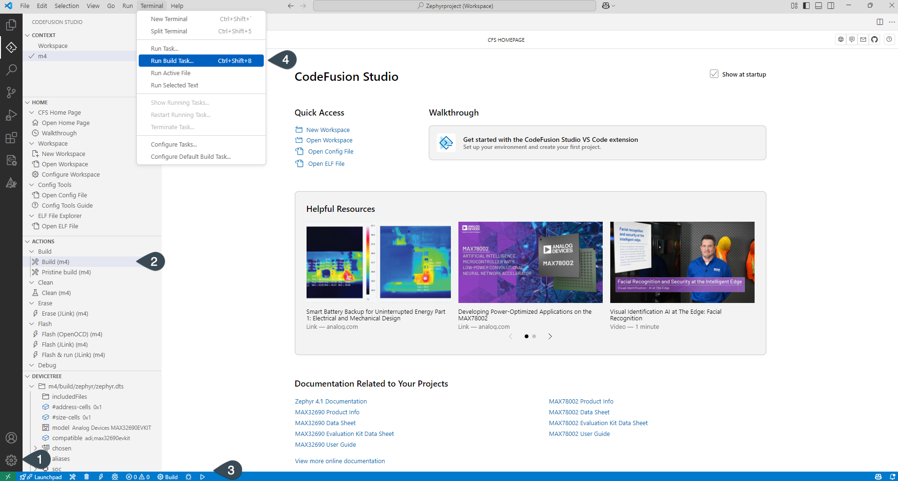
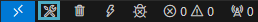
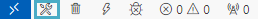
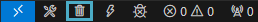
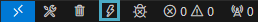
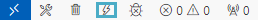
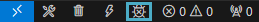
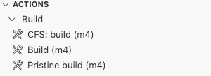

# Tasks to build, clean, flash and debug

After [creating a workspace](./create-new-workspace.md) and configuring it, you can run various tasks to create, flash, clean, and run applications.

## Access the tasks

Tasks can be accessed in the following ways:

1. **Command palette**: Open the command palette (`Ctrl+Shift+P` or `Cmd+Shift+P`on macOS) from the **Manage gear** icon and enter the task name.
1. **Actions view**: Click the **CFS icon** {.only-light} {.only-dark} in the **Activity Bar**, then choose a task from the **Actions** view. You can also create new custom tasks by clicking **Copy and Edit** {.only-dark}{.only-light} next to each task.
1. **Status Bar**: Click a relevant icon (build, flash, erase) on the left side of the **Status Bar**.
1. **From the menu**: Go to **Terminal > Run Build Task**, then select the desired task.

{.only-dark}
{.only-light}

```{note}
All tasks operate in the same way independent of the mechanism used to invoke them.
```

## Tasks

### CFS: build

The **CFS: build** task compiles the code using **make**. Options are passed into the make file on the command line based on the project's `settings.json` file. It creates the `./build` directory, which contains the output binary and all intermediary object files.

The build configuration variables used by the makefiles are set during workspace creation, or in the workspace, user or system settings.

```{note}
Shortcut: `Ctrl` + `Shift` + `B` (Windows/Linux) or `Command` + `Shift` + `B` (Mac).
The build task is also available with shortcuts on the left-hand side of the status bar.
{.only-dark}
{.only-light}
```

### CFS: clean

The **CFS: clean** task cleans the build output, removing the `./build` directory and all of its contents.

```{note}
The clean task is available with the shortcut on the left-hand side of the status bar.
{.only-dark}
{.only-light}
```

### CFS: clean-periph

The **CFS: clear-periph** tasks runs [CFS: clean](#cfs-clean) as well as removes the build output for the MSDK's peripheral drivers. Use **CFS: clean-periph** to recompile the peripheral drivers from source on the next build.

### CFS: flash

The **CFS: flash** task first runs the [CFS: build](#cfs-build) task. Then, it flashes the output binary to the microcontroller. It uses the **GDB** load and compare-sections commands, and launches an **OpenOCD** internally using a pipe connection. This halts the flashed program until the microcontroller is reset, power cycled, or a debugger is connected. A debugger must be connected correctly to use this task. Refer to the data sheet of your microcontroller's evaluation board for instructions.

```{note}
The flash task is available with the shortcut on the left-hand side of the status bar.
{.only-dark}
{.only-light}
```

### CFS: flash and run

The **CFS: flash and run** task runs the [CFS: flash](#cfs-flash) task and resumes execution of the program after flashing is complete.

### CFS: erase flash

The **CFS: erase flash** task erases all of the application code in the flash memory bank. After running this task, the target microcontroller is effectively blank. This is useful for recovering from low power (LP) lockouts, bad firmware, or other issues.

### CFS: debug

The **CFS: debug** task will launch the previous debug session. This may run the [CFS: flash](#cfs-flash) command before running the application and halting at the breakpoint at `main()`. The executable file will need to be built using the [CFS: build](#cfs-build) command before debugging. Care should be made to ensure the executable is up to date before debugging.

Using the activity view you can select a debug session to launch. See [Debugging an application](../debugging/debug-an-application.md) for more information.
```{note}
The clean task is available with the shortcut on the left-hand side of the status bar.
{.only-dark}
{.only-light}
```

## Create custom tasks

To create a custom build or flash task, do one of the following:

- Click the dropdown arrow in the **Terminal** panel and select **Configure Tasks**. Then choose a task from the list to copy.
- In the **Actions** view, click **Copy and Edit** {.only-dark}{.only-light} next to the task you want to duplicate.

This opens your project's `.vscode/tasks.json` file and adds a copy of the selected task. You can now edit the copy without affecting the original.

The new task also appears as a separate entry in the **Actions** view, with a label that starts with `CFS:` (for example, `CFS: build`).

{.only-dark}
{.only-light}

```{tip}
To personalize your task, append a description to the `label` in `tasks.json`. For example: `"label": "CFS: build MAX32690-debug"`
```

## Modify build tasks

To modify a custom build or flash task, do one of the following:

- Click the dropdown arrow in the **Terminal** panel and select **Configure Tasks**. Then choose the task your previously created from the list.
- In the **Actions** view, click **Edit** {.only-dark}{.only-light} next to your custom task.

The `.vscode/tasks.json` file opens in your editor. You can update the task directly in the file.

For more information on modifying build tasks, see [Custom tasks](https://code.visualstudio.com/docs/editor/tasks#_custom-tasks)
