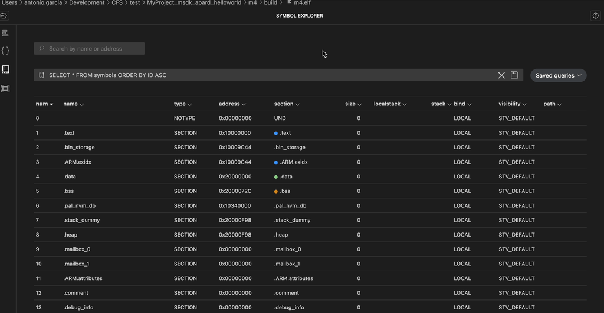

# Overview

CodeFusion Studio (CFS) is an embedded software development platform based on Microsoft's Visual Studio Code (VS Code). It provides best-in-class development tooling for ADI's embedded processors and MCUs, and includes intuitive tools for newcomers while enabling advanced features for expert embedded developers.

## Prerequisites

The Visual Studio Code extension requires CodeFusion Studio to be present. Download and run the [CFS installer](https://developer.analog.com/docs/codefusion-studio/1.0.0/user-guide/installation/install-cfs/). This installs the required toolchains, SDK components, and command line tools of CodeFusion Studio.

## Features

- Homepage with quick access links for common tasks, links to articles and videos related to your projects, user guides, hardware reference manuals, data sheets, and other useful resources.
- A new project wizard for quickly creating projects as well as example applications to jumpstart your development.
    

- Toolchains that support building for ARM and RISC-V processors.
- Integrated pin and clock configuration tools for assigning signals to pins, configuring pin values such as input or output mode and power supply, viewing register details and values, and generating source code to be included in your project.
- Essential debugging tools including heterogeneous debug, breakpoints, disassembly and more.

    

## Product Details

- Permissive open-source license
- Integrated support for Zephyr RTOS (Zephyr 3.7)
- Native support for ADI's MAX Software Development Kit (MSDK)
- Modern UI with a CI-friendly command-line utility
- Mulit-core project creation on supported parts
- ELF file visualization tools for analyzing compiled applications
- Roadmap of new features to streamline embedded development and give engineers greater control in solving difficult design challenges

## Documentation

See the [User documentation](https://developer.analog.com/docs/codefusion-studio/1.0.0/) for the user guide and other resources for CodeFusion Studio.
